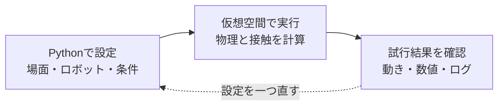

# NVIDIA Isaac Labではじめるロボット学習 初稿

Pythonを少し触った人のためのシミュレーション入門

仕様確認日：2026年10月4日

## はじめに

ロボットに「歩いて」と伝えるだけで、足が自然に動くわけではありません。どの関節をどれくらい動かすか、体が傾いたときにどう立て直すか、床が滑ったときにどう対応するか。ロボットを動かすには、たくさんの判断が必要です。

その判断の方法を、試行錯誤から学ばせる技術がロボット学習です。本書では、NVIDIA Isaac Labを使うための基礎を、Pythonの短い例と画面の見方を交えながら学びます。

最初の目標は、優秀な歩行ロボットを作ることではありません。「シミュレーターが起動する」「床と照明を置ける」「ロボットの関節や設定を読み取れる」という、小さな成功を順に積み重ねます。これができると、公式サンプルのどこを変更すればよいか、自分で見当をつけられるようになります。

この初稿には第1〜5章と第8章を収録しています。第6章のBittle、第7章のTurtleBot3によるハンズオンは今回の範囲に含めず、将来追加するときのために章番号を残します。

**扉図 学習の進め方（概念図）**



設定、実行、確認を一周として繰り返す。

## 対象読者と前提知識

本書は、Pythonで変数、`if`、`for`、関数を一度は使ったことがある人を対象にしています。ロボット工学や強化学習を学んだ経験は必要ありません。

たとえば、次のコードの意味がなんとなくわかれば、読み始められます。

```python
def is_near_goal(distance):
    return distance < 0.1

for distance in [1.0, 0.5, 0.05]:
    print(distance, is_near_goal(distance))
```

`distance`は目標までの距離です。0.1より小さければ、`True`、つまり「条件を満たしている」と判定します。本書でも、数値や条件を使ってロボットと環境を設定します。

コマンドを入力する画面は、Linuxでは「端末」、Windowsでは「コマンドプロンプト」などと呼ばれます。これらをまとめてターミナルと呼びます。コードを編集するソフトはエディターです。どちらも、画面を見ながら少しずつ慣れていけば大丈夫です。

本書の実行手順は、NVIDIA RTX GPUを搭載したUbuntuまたはWindowsのコンピューターを前提にします。GPUは、多くの計算を並行して処理する装置です。Macは本文の作成やコードの閲覧には使えますが、本書のIsaac Sim実行環境には含めません。Macから取り組む場合は、対応する別のPCやリモートGPU環境を用意します。

## 本書の版と読み方

Isaac LabとIsaac Simは別の製品で、それぞれにバージョンがあります。同じ数字にそろえればよいという関係ではありません。

確認時点の公式リポジトリでは、Isaac Labの`v3.0.0-EA`タグがIsaac Sim 6.1に対応しています。EAはEarly Access、つまり先行公開版を意味します。公式の3.0系列の導入ページには、配布Pythonパッケージとして`3.0.0rc1`も記載されています。rcは正式版候補を表します。本書は、この先行公開系列のソースをタグで固定して説明します。正式版としての安定性や、すべてのサンプルの動作を保証するものではありません。[公式の対応表](https://github.com/isaac-sim/IsaacLab#isaac-sim-version-dependency)、[対象版の導入手順](https://isaac-sim.github.io/IsaacLab/v3.0.0-EA/source/setup/installation/index.html)

| 本書で扱う項目 | 基準 |
| --- | --- |
| Isaac Labのソース | `v3.0.0-EA`タグ |
| Isaac Sim | 6.1系列 |
| Python | 3.12 |
| 主なOS | Ubuntu 22.04／24.04、Windows 11のx86_64環境 |
| 導入方法 | `uv`によるソース環境の管理 |
| 画面表示 | Isaac Simを使うKitの画面 |

`develop`は開発中のブランチ、つまり日々変更されるソースの系列です。本文ではこれを直接使いません。また、2.x系列の記事にあるPythonや関節操作のコードを、3.0系列へそのまま混ぜないようにします。

Omniverseは、NVIDIAの3Dシミュレーションに関わる技術基盤です。本書ではOmniverse Launcherを経由するインストールを使いません。現在の公式導入経路に沿って、必要なソフトを取得します。

本文の図は理解を助ける概念図です。「公式資料の参考画面」はNVIDIA公式チュートリアルの掲載画像であり、本書の指定環境で撮影した結果ではありません。実行コマンドは公式資料と公開ソースを照合しましたが、この初稿ではIsaac Lab `v3.0.0-EA`とIsaac Sim 6.1の組み合わせをGPUで実行確認していません。未撮影の写真には、撮影時に確かめる項目を残しています。

## 目次

- 第1章 本書の目的

- 第2章 知っておくべき基礎知識

- 第3章 NVIDIA Isaac Labとは

- 第4章 環境構築

- 第5章 ロボットと環境の設定方法

- 第6章 ハンズオン実践1 Bittle 今回は未収録

- 第7章 ハンズオン実践2 TurtleBot3 今回は未収録

- 第8章 まとめと今後の展望

- 付録 次に読む公式リソース

- 付録 図版制作と実行確認の記録

