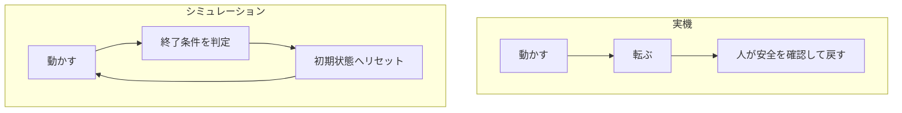
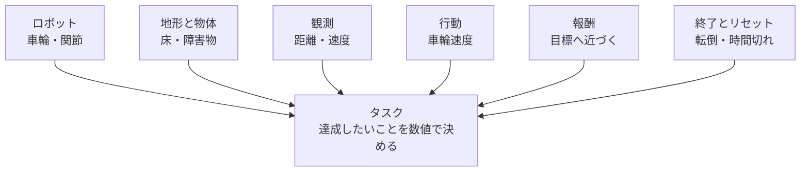

## 第1章 本書の目的

### 1.1 仮想空間でロボットを試す

シミュレーションとは、現実の仕組みをコンピューター上で再現して、結果を調べることです。ロボットのシミュレーターでは、床、物体、関節、重力などを設定し、ロボットがどのように動くかを計算します。

画面にロボットの姿を描くだけなら、3Dアニメーションでもできます。シミュレーションで大切なのは、その裏側で力や接触を計算していることです。足が地面を押せば体が動き、重心が支えから外れれば倒れる。こうした関係を計算する仕組みを、物理エンジンと呼びます。

仮想空間なら、転倒したロボットを元の姿勢へ戻して、すぐに次の試行を始められます。ただし、現実を完全に再現できるわけではありません。摩擦、部品のたわみ、通信遅延などは、モデル化の仕方によって結果が変わります。

**図1-1 試行のやり直し（概念図）**

実機では人が安全を確認して戻す。シミュレーションでは終了条件に従い状態を戻せる。

### 1.2 Isaac Labで何を実現できるか

Isaac Labは、ロボット学習の実験環境を作るためのオープンソースのフレームワークです。フレームワークは、よく使う処理をまとめた開発の土台です。ロボットやセンサーを配置するだけでなく、観測、行動、報酬、リセットを組み合わせて学習の課題を作れます。[Isaac Lab公式概要](https://github.com/isaac-sim/IsaacLab)

たとえば、車輪型ロボットで目標地点へ近づく、アームで物体へ手を伸ばす、四足歩行ロボットで指定された速度に近づく、といった課題を考えられます。学習の課題を、以後「タスク」と呼びます。

タスクを作るときは、「ロボットに何を達成してほしいか」を具体的な数値や条件にします。「うまく歩く」だけでは曖昧です。「目標の前進速度に近づく」「倒れない」「関節を急激に動かしすぎない」と分けると、設定すべき項目が見えてきます。

この本では、タスクを完成させる前に、その材料を理解します。ロボットモデル、環境、センサー、設定ファイルがどう関係するかをつかむことが、後のハンズオンにつながります。

**図1-2 タスクの材料（概念図）**

タスクはロボットだけでなく、環境、観測、行動、評価、終了条件を組み合わせて定義する。

### 1.3 読み終えたときの到達点

本書を読み終えたら、次のことを自分の言葉で説明できる状態を目指します。

- Isaac SimとIsaac Labが担当する役割。

- 観測を受け取って行動を返す、ロボット制御の流れ。

- 対応するバージョンを選び、公式サンプルを起動する方法。

- ロボットの見た目と、物理計算に必要な設定の違い。

- シミュレーションの結果を実機へ移すときに調べる項目。

ここではTurtleBot3のナビゲーションやBittleの歩行学習を完成させません。また、画面のロボットが動いたことと、学習が成功したことは分けて考えます。ランダムな力を与えてもロボットは動きますが、その動作は目標を達成する方策とは限りません。

**未撮影の写真：写真1-1。** 第5章の関節モデルのサンプルを起動し、モデル全体と床が見える画面を撮る。「これはモデルと物理計算の確認。学習済みの動作ではない」とキャプションを付ける。

撮影時は、①対象のOSとIsaac Sim／Isaac Labの版、②実行したコマンドまたは画面操作、③撮影した時点、④画面で読める成功・失敗の根拠を記録する。画面上の実際の名前と本文の例が異なる場合は、キャプションを実画面に合わせる。

### 1.4 チェックポイント

- [ ] シミュレーションで何を計算するかを説明できる。

- [ ] 作ってみたいタスクを一文で書ける。

- [ ] 「動いた」と「学習できた」を分けて考えられる。

つまずきポイント：最初から実機と同じロボットを用意しようとすると、モデル作成、物理設定、制御、学習が同時に問題になります。まず公式の小さなモデルを使い、起動と設定の読み方を覚えましょう。

