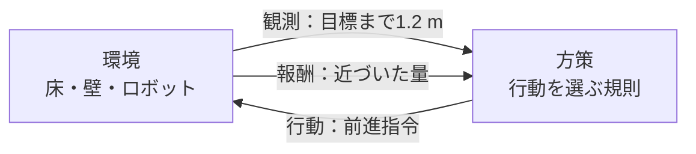
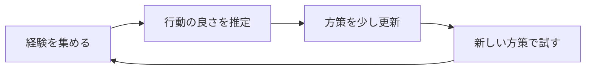
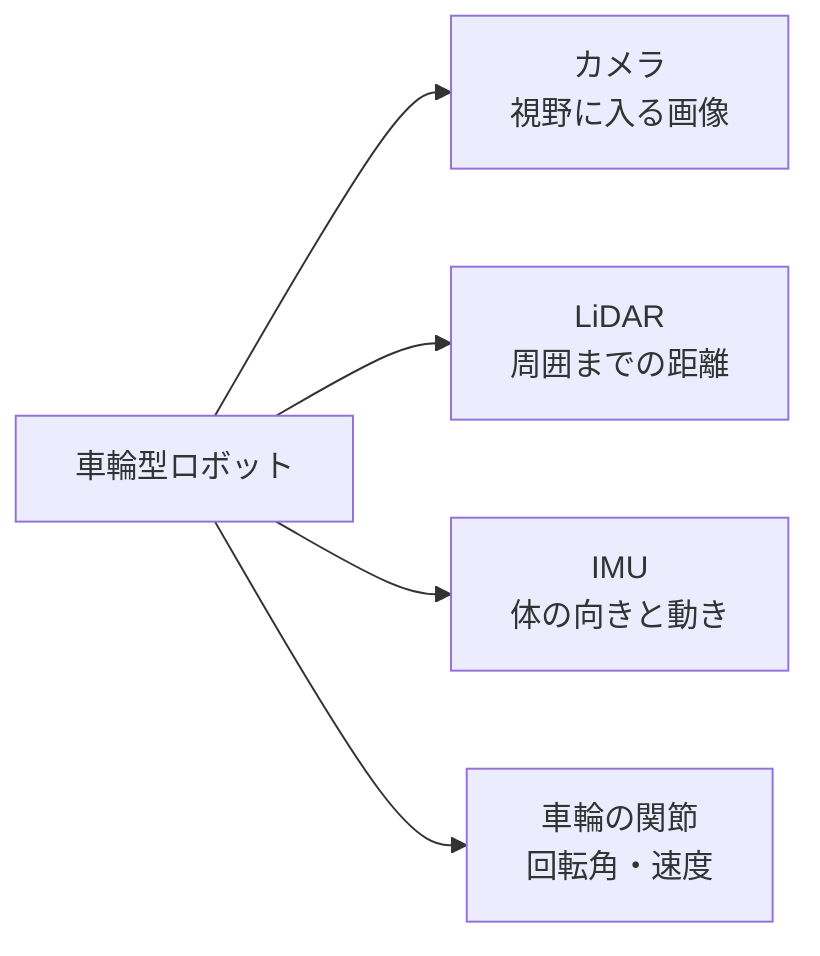
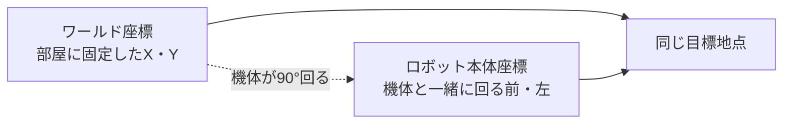

## 第2章 知っておくべき基礎知識

### 2.1 強化学習の登場人物

強化学習は、行動の結果として得られる評価を手がかりに、行動の選び方を改善する方法です。ここでは、目標地点へ向かう小さな車輪型ロボットを例にします。

ロボットが走る床や壁を含む、試行の場を「環境」と呼びます。行動を選ぶ主体を「エージェント」と呼びます。エージェントは物理的な機体そのものではなく、機体に指示を出す計算の仕組みと考えるとわかりやすいでしょう。

エージェントに渡す情報が「観測」です。たとえば、目標までの方向、車輪の回転速度、障害物までの距離です。観測をもとに返す指示が「行動」です。左右の車輪速度や、関節の目標角度などを使います。

行動の結果を評価した数値が「報酬」です。目標に近づいたら加点し、衝突したら減点する、といった設計ができます。観測から行動を選ぶ規則を「方策」と呼びます。学習の目的は、長い目で見た報酬の合計を増やせる方策を見つけることです。

**図2-1 強化学習の一巡（概念図）**



環境から得た観測を方策へ渡し、行動の結果として次の観測と報酬を受け取る。

### 2.2 1回の試行を区切る

観測を受け取り、行動し、環境を進める一巡を「ステップ」と呼びます。試行の開始から終了までのまとまりは「エピソード」です。

目標へ到達した、転倒した、制限時間になった、といった条件でエピソードを終えます。終了後に初期状態へ戻すことを「リセット」と呼びます。学習中は、これを繰り返して経験を集めます。

Pythonで考え方だけを表すと、次のようになります。この例は流れを説明するための疑似コードで、そのまま実行するIsaac Labのプログラムではありません。

```python
# 疑似コード。各関数の実装は省略しています。
observation = reset_environment()
while not episode_finished:
    action = policy(observation)
    observation, reward, episode_finished = step_environment(action)
```

実際の環境では、タスクの成否による終了と、時間上限による打ち切りを別に扱うことがあります。公式コードに`terminated`と`truncated`が出てきたら、どちらの理由で試行が終わったかを確認してください。

### 2.3 PPOは何をしているか

PPOはProximal Policy Optimizationの略で、方策を改善する強化学習アルゴリズムの一つです。アルゴリズムとは、問題を解くための手順です。

大まかには、現在の方策で経験を集め、予想より良かった行動の選ばれやすさを増やし、悪かった行動の選ばれやすさを減らします。このとき、方策を一度に変えすぎない工夫を使います。「良い方向へ修正するが、一回の修正で大きく崩さない」という考え方です。PPOにはいくつかの実装形がありますが、代表的なものは更新量を抑えるクリッピングを使います。[PPOの原論文](https://arxiv.org/abs/1707.06347)

ここでの「良かった」は、その瞬間の報酬だけでは決まりません。その後も含めてどれだけ報酬を得られたかを推定し、行動を評価します。今は少し遠回りしても、その後の衝突を避けられるなら、有益な行動になり得ます。

PPOが賢くても、ロボットに必要な観測がなければ判断できません。報酬の設計が目的とずれていれば、望まない動作が高く評価されることもあります。アルゴリズムを選ぶ前に、何を見せ、何を操作させ、何を評価するかを考えましょう。

**図2-2 PPOの反復 概念図（概念図）**



PPOの処理順を示す概念図であり、学習成績の測定結果ではない。

### 2.4 報酬を短いPythonで考える

次の例は普通のPythonだけで実行できます。距離はメートルとし、1ステップで目標に近づいた量を報酬にします。これは説明用の報酬で、完成したナビゲーション用タスクではありません。

```python
def reward_for_step(previous_distance, current_distance, collided):
    progress = previous_distance - current_distance
    collision_penalty = 1.0 if collided else 0.0
    return progress - collision_penalty

print(reward_for_step(2.0, 1.8, False))  # 約0.2
print(reward_for_step(2.0, 2.1, False))  # 約-0.1
print(reward_for_step(2.0, 1.8, True))   # 約-0.8
```

衝突の減点が大きすぎると、ロボットが動かなくなる可能性があります。逆に小さすぎると、ぶつかってでも目標へ近づく動作が選ばれるかもしれません。こうした違いを、動画と数値の両方で確認します。

「報酬が上がった」だけで成功としないことも大切です。目標到達率、衝突の回数、到達までの時間など、目的に直接関係する指標も記録します。

### 2.5 ロボットのセンサー

センサーは、周囲や自分の状態を測る装置です。シミュレーションでは、その測定結果を計算で再現します。

| センサー | 測るもの | 使い道と注意点 |
| --- | --- | --- |
| RGBカメラ | 赤・緑・青の画像 | 物体や周囲を見る。画像を処理する計算量が必要 |
| 深度カメラ | 各画素の距離 | 物体の形や距離を調べる。距離の単位を確認 |
| LiDAR | 光を使った距離計測 | 障害物や形状を調べる。方式や点群の座標系を確認 |
| IMU | 加速度と角速度など | 体の動きや姿勢推定に使う。取り付け向きや重力の扱いを確認 |
| 関節エンコーダー | 関節角度や回転位置 | 自分の関節の状態を知る。角度の単位に注意 |
| 接触センサー | 接触の有無や力など | 足が接地したかを調べる。対象物と接触の設定が必要 |

IMUはInertial Measurement Unit、慣性計測装置です。IMUが直接、誤差のない位置を教えてくれるわけではありません。測定値を使って姿勢や動きを推定します。

Isaac Labにはカメラ、IMU、接触センサー、Ray Casterなどの仕組みがあります。Ray Casterは仮想的な線を飛ばし、物体と交わる位置を調べる仕組みです。地形の高さを測る用途などに使えますが、RTX LiDARと同じセンサーとして扱うことはできません。対象物や対応するバックエンドを確認します。[公式のセンサー一覧](https://isaac-sim.github.io/IsaacLab/v3.0.0-EA/source/concepts/sensors/index.html)

**図2-3 センサーが測るもの（概念図）**



各センサーの情報は異なる。3D画面で見えるものが、そのままロボットの観測になるわけではない。

**未撮影の写真：写真2-1。** 後のセンサー学習時に、3D画面と実際のカメラ出力を左右に並べて撮る。画面を眺める視点と、ロボットが観測する視点が異なることを矢印で示す。未実装のセンサー出力を合成して実測画面に見せない。

撮影時は、①対象のOSとIsaac Sim／Isaac Labの版、②実行したコマンドまたは画面操作、③撮影した時点、④画面で読める成功・失敗の根拠を記録する。画面上の実際の名前と本文の例が異なる場合は、キャプションを実画面に合わせる。

### 2.6 単位と座標系

座標系は、位置や向きを数値で表すときの基準です。部屋全体を基準にしたワールド座標系と、ロボット本体を基準にした座標系では、同じ物体の位置でも数値が変わります。

ロボットが右を向くと、本体から見た「前」も右へ変わります。ワールドの前方向は変わりません。関数やデータに`world`、`body`などの名前が付いていたら、どの基準の値か確認します。

角度には度とラジアンがあります。ラジアンは、一周を約6.283として表す単位で、180度はπラジアンです。Pythonの`math.pi`を使うと、この変換を確かめられます。

```python
import math

degrees = 90.0
radians = math.radians(degrees)
print(round(radians, 3))  # 1.571
```

向きを4つの数で表すクォータニオンという形式もあります。4つの数の並びはAPIによって異なるため、順番を思い込みで決めないようにします。

**図2-4 座標系で方向が変わる（概念図）**



ワールド軸は部屋に固定され、本体軸はロボットと一緒に回る。

### 2.7 チェックポイント

- [ ] 観測、行動、報酬、方策を一つずつ例で説明できる。

- [ ] ステップとエピソードの違いがわかる。

- [ ] カメラ、LiDAR、IMUが何を測るかを説明できる。

- [ ] 角度と距離の単位、座標系を確認する習慣が付いた。

つまずきポイント：シミュレーター内部で読める正確な位置を、実機でも同じように取得できるとは限りません。学習に使う情報と、実機で測れる情報を分けて整理しましょう。

