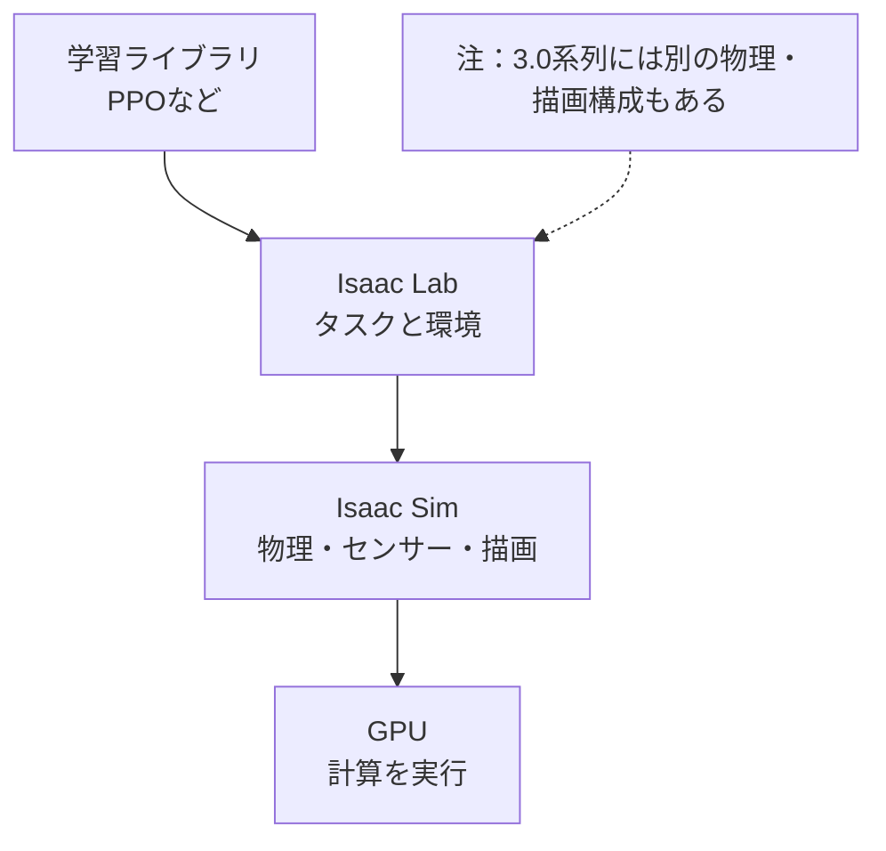
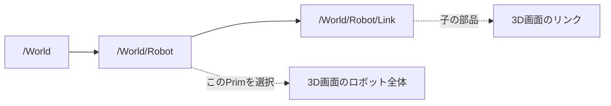
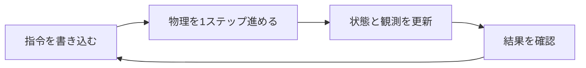
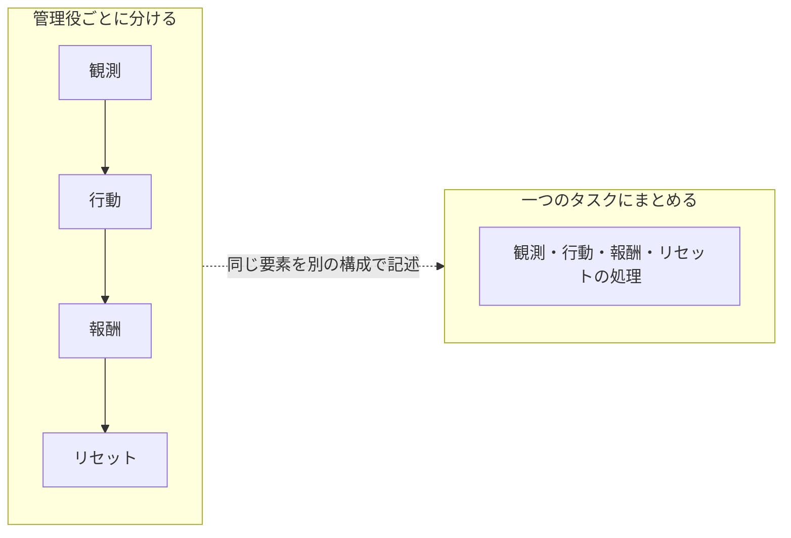

## 第3章 NVIDIA Isaac Labとは

### 3.1 Isaac SimとIsaac Labの役割

Isaac Simは、ロボットのシミュレーションに使うソフトウェアです。3Dの場面、物理計算、センサー、外部システムとの接続などを扱います。Isaac Labは、そのようなシミュレーションをロボット学習の実験へ組み立てるための仕組みを提供します。

本書ではIsaac Simを使う構成に絞って操作を説明します。ただし、Isaac Lab 3.0系列にはIsaac Simを起動せずに動くKit-less構成もあります。Kitは、Omniverseのアプリケーションを動かす基盤です。Kit-lessは、それを使わない実行方式を意味します。[公式のバックエンド説明](https://isaac-sim.github.io/IsaacLab/v3.0.0-EA/source/concepts/backends_and_presets.html)

したがって、「Isaac Labなら必ずIsaac Simの画面が開く」という理解では、現在の構成を説明しきれません。学習の計算、物理計算、センサー用の画像生成、人が確認する画面を分けて考えます。

**図3-1 本書で使う構成（概念図）**



本書の画面付き手順はIsaac Simを使う構成を対象とする。

### 3.2 バックエンドという言葉

バックエンドは、表面の共通の操作の裏で、実際の仕事を担当する実装です。Isaac Lab 3.0では、物理計算や描画の実装を選ぶ構成があります。

物理計算は物体の動きを決め、レンダラーはセンサー用の画像などを生成します。ビジュアライザーは、人が様子を確認するための表示を担当します。この三つは役割が違います。画面表示を消しても、カメラを観測に使うタスクでは画像生成が必要になることがあります。

タスクのコマンドにある`physics=isaacsim_physx`は、物理の構成を選ぶ指定です。`--viz kit`は表示方法の指定です。ただし、使える組み合わせはタスクやスクリプトによって異なります。タスク用の指定を、すべての短いPythonスクリプトに付けられるわけではありません。

初めのうちは、公式サンプルの指定を維持しましょう。一度に物理エンジンと表示方法を変更すると、問題の原因を追いにくくなります。

### 3.3 USDで場面を記述する

USDはUniversal Scene Descriptionの略で、3Dの場面を記述し、複数のデータを組み合わせるための仕組みです。OpenUSDという名前でも目にします。

ロボットの形状だけでなく、物体の位置、材質、階層構造などを扱えます。Isaac Simの物理用の情報を加えると、質量、衝突、関節などの設定も持たせられます。ファイルがUSD形式であるだけで、正しいロボットの物理モデルになるわけではありません。[公式のアセット導入説明](https://isaac-sim.github.io/IsaacLab/v3.0.0-EA/source/how-to/import_new_asset.html)

開かれた場面全体は「Stage」と呼ばれます。Stageの中の各要素は「Prim」と呼ばれ、`/World/Robot`のようなパスで識別できます。パスは場面の中の住所です。ファイルの保存場所とは別のものです。

```text
/World
├── Ground
├── Light
└── Robot
    ├── Base
    └── Arm
```

これは説明用の階層です。実際のロボットの名前や構造はアセットごとに異なります。

**図3-2 Primのパスと3Dの対応（概念図）**



Primのパスは場面内の住所であり、Stageの階層と3D画面の物体を結び付ける。

**未撮影の写真：写真3-1。** ロボットのサンプルでStageパネルを開き、モデルの親Primを選択する。選択中のパス、階層、3D画面での選択状態を一枚に収める。本文の例と実際の名前が違う場合は、撮影画面の名前に合わせてキャプションを書く。

撮影時は、①対象のOSとIsaac Sim／Isaac Labの版、②実行したコマンドまたは画面操作、③撮影した時点、④画面で読める成功・失敗の根拠を記録する。画面上の実際の名前と本文の例が異なる場合は、キャプションを実画面に合わせる。

### 3.4 計算グラフと実行フロー

計算グラフは、処理を箱、データや実行のつながりを線で表したものです。「時刻を受け取る→センサー値を読む→外部へ送る」と描くと、処理の順番を追いやすくなります。

Isaac Simでは、OmniGraphを使って処理をノードで組み立てる方法があります。ノードは、一つの処理を担当する箱です。ただし、Isaac Labの学習処理を理解するために、最初からOmniGraphの画面でタスク全体を作る必要はありません。

本書ではPythonの実行フローを先に見ます。起動後に場面を作り、初期化し、繰り返しの中で指令を書き込み、物理計算を進め、更新後の状態を読む。この順番を理解すると、公式コードが読みやすくなります。[空の場面を作る公式例](https://isaac-sim.github.io/IsaacLab/v3.0.0-EA/source/tutorials/00_sim/create_empty.html)、[関節モデルを操作する公式例](https://isaac-sim.github.io/IsaacLab/v3.0.0-EA/source/tutorials/01_assets/run_articulation.html)

**図3-3 シミュレーションの実行順序（概念図）**



これは実行順序の説明図であり、OmniGraphの実画面ではない。

### 3.5 Manager-basedとDirect

Isaac Labには、タスクの処理を役割別に分けるManager-based方式と、タスクのクラスへ直接書くDirect方式があります。クラスは、関連するデータと処理をまとめるPythonの仕組みです。

Manager-based方式では、観測、行動、報酬などを担当する管理役へ分けます。報酬の項目を差し替えて比較するような場面で、構造を追いやすくなります。Direct方式では、処理の流れを一つのクラスの中で追いやすい一方、自分で扱う範囲が増えます。[公式のタスク設計方式](https://isaac-sim.github.io/IsaacLab/v3.0.0-EA/source/concepts/task_workflows.html)

どちらかが、すべての初心者にとって簡単というわけではありません。最初は読んでいるサンプルと同じ方式を使い、途中で方式を変えずに一つの流れを理解しましょう。

**図3-4 タスクのコードの分け方（概念図）**



観測、行動、報酬、リセットという材料は同じで、コードの置き方が異なる。

### 3.6 チェックポイント

- [ ] 本書がIsaac Simを使う構成であるとわかる。

- [ ] 物理計算、画像生成、確認用の画面を区別できる。

- [ ] Primのパスとファイルのパスを区別できる。

- [ ] Pythonのループと計算グラフの役割を説明できる。

つまずきポイント：古い資料では`omni.isaac.lab`などの名前が出てくることがあります。本書の`isaaclab`と混ぜず、資料の対象バージョンと移行ガイドを確認してください。

