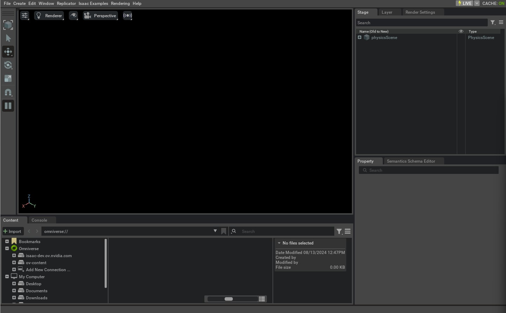

## 第4章 環境構築

### 4.1 まず実行環境を確認する

インストールは、対応しているOSとGPUを確認してから始めます。GPUが付いているだけでは十分ではありません。Isaac Simの画面やRTX機能には、対応するNVIDIA GPUが必要です。

確認時点のIsaac Sim公式要件表は、x86_64環境について次の値を掲載しています。これは要件表の基準であり、すべての学習タスクがこの構成で余裕を持って動くという意味ではありません。[Isaac Sim公式要件](https://docs.isaacsim.omniverse.nvidia.com/latest/installation/requirements.html)

| 項目 | 公式要件表の最低構成 |
| --- | --- |
| OS | Ubuntu 22.04／24.04、Windows 11 |
| CPU | Intel Core i7 第7世代、またはAMD Ryzen 5を基準に掲載 |
| CPUコア | 4 |
| メモリー | 32 GB |
| ストレージ | 50 GB SSD |
| GPU | GeForce RTX 4080 |
| GPUメモリー | 16 GB |
| テスト済みドライバー | Linux 595.58.03、Windows 595.97 |

GPUメモリーをVRAMと呼びます。通常のメモリーとは別の容量です。カメラや並列環境を増やすと、RAMとVRAMの両方が多く必要になることがあります。50 GBは学習ログや追加アセットの容量を十分に見込んだ値ではないため、作業用の空き容量にも余裕を持たせます。

公式のIsaac Lab導入ページに掲載されたドライバー推奨値と、Isaac Simの要件表にあるテスト済み値には差があります。本書では低い数値だけを満たせばよいと判断せず、使用するIsaac SimとGPUに対応する現行のProduction Branchドライバーを選び、Compatibility Checkerで確認します。Compatibility Checkerは、環境の互換性を調べる公式ツールです。

CPUやメモリーが強力でも、対応外のGPUを補うことはできません。公式要件ではRT Coreを持たないA100やH100は、Isaac Simの対象外です。クラウドでも、GPUの名前を確認してから選びます。

**未撮影の写真：写真4-1。** 公式要件ページのOS、RAM、GPU、VRAM、ドライバーの行を撮影する。ページの対象バージョンと取得日を欄外に記録する。本文の要件表と撮影時の値が一致するか確認する。

撮影時は、①対象のOSとIsaac Sim／Isaac Labの版、②実行したコマンドまたは画面操作、③撮影した時点、④画面で読める成功・失敗の根拠を記録する。画面上の実際の名前と本文の例が異なる場合は、キャプションを実画面に合わせる。

### 4.2 この章で使う導入方法

本書は`uv`を使い、Isaac Labのソース一式から実行します。uvは、Pythonの実行環境と必要なパッケージを管理するツールです。プロジェクトの指定に基づいて環境を用意するため、異なる用途のPython環境を混ぜにくくなります。

公式の対象版では、この自動セットアップが推奨されています。`--extra isaacsim`は、追加機能としてIsaac Simを環境へ含める指定です。`all`だけを指定しても、Isaac Simが含まれるとは限りません。[対象版のインストール案内](https://isaac-sim.github.io/IsaacLab/v3.0.0-EA/source/setup/installation/index.html)

以下の手順は、読み取り確認とインストールを分けて記します。掲載コマンドを、対応GPUのPCで順に実行してください。この原稿を読むだけなら、今のPCへインストールする必要はありません。

### 4.3 手順1 GPUと基本ツールを確認する

Ubuntuの端末、またはWindowsのコマンドプロンプトで実行します。次の二つは確認用で、インストールはしません。

```text
nvidia-smi
git --version
```

`nvidia-smi`は、GPUの名前、ドライバー、メモリー使用量などを表示します。見つからない、GPUが認識されない、といった場合は、先にドライバーの問題を解決します。

Gitは、ソースコードの履歴を管理し、公開リポジトリを取得するツールです。リポジトリは、ソースコードと履歴をまとめた保管場所です。`git --version`が失敗する場合は、OSに対応するGitを用意します。

UbuntuではOSとGLIBCも確認します。GLIBCはLinuxでプログラムを動かす基本ライブラリで、Isaac SimのPython配布には2.35以上が必要です。

```bash
cat /etc/os-release
ldd --version
```

**未撮影の写真：写真4-2。** `nvidia-smi`の結果を撮る。GPU名、Driver Version、Memory Usageの3か所を囲む。右上のCUDA Versionは、このドライバーが対応できるCUDAの目安であり、別途インストールしたCUDA Toolkitの版を示す値と決めつけない。

撮影時は、①対象のOSとIsaac Sim／Isaac Labの版、②実行したコマンドまたは画面操作、③撮影した時点、④画面で読める成功・失敗の根拠を記録する。画面上の実際の名前と本文の例が異なる場合は、キャプションを実画面に合わせる。

### 4.4 手順2 uvを用意する

ここからはソフトをインストールします。Ubuntuでは公式インストーラーを使います。取得したスクリプトを実行するコマンドです。

```bash
curl -LsSf https://astral.sh/uv/install.sh | sh
```

Windowsでは、公式のIsaac Lab手順に従い、コマンドプロンプトで次を実行します。

```bat
powershell -ExecutionPolicy ByPass -c "irm https://astral.sh/uv/install.ps1 | iex"
```

インストール後、新しい端末を開き、次の確認をします。

```text
uv --version
```

Windowsでは長いファイルパスが問題になることがあります。対象版の公式手順は、取得前にWindowsの長いパスを有効にするよう案内しています。管理者として開いたPowerShellで、次を実行します。これはOSの設定を書き換える操作です。

```powershell
New-ItemProperty -Path "HKLM:\SYSTEM\CurrentControlSet\Control\FileSystem" -Name LongPathsEnabled -Value 1 -PropertyType DWORD -Force
```

実行後は新しいコマンドプロンプトを開いて、次の手順へ進みます。組織で管理されているPCは、管理者の定めた手順に従います。

### 4.5 手順3 公開タグを固定して取得する

ソースを保存したい作業フォルダーで、次を実行します。`IsaacLab`というフォルダーを新しく作り、公開ソースを取得します。同名の既存フォルダーがある場合は、新しい別の作業場所を使ってください。

```text
git clone --branch v3.0.0-EA https://github.com/isaac-sim/IsaacLab.git
cd IsaacLab
git describe --tags --always
git rev-parse HEAD
```

最後の二つは確認用です。表示されたタグとコミットを記録します。コミットは、ソースの特定の状態を識別するものです。「最新版」という言葉より、具体的なタグとコミットがあるほうが、後から同じ状態を調べやすくなります。

タグを取得すると、Gitがdetached HEADという案内を出すことがあります。特定の版を読む目的なら、それだけで失敗ではありません。自分の変更を履歴に残す場合は、別途作業ブランチを作ります。

**未撮影の写真：写真4-3。** `git describe`と`git rev-parse HEAD`の結果を撮る。タグとコミットを囲み、「本書の撮影環境を再現する情報」と添える。

撮影時は、①対象のOSとIsaac Sim／Isaac Labの版、②実行したコマンドまたは画面操作、③撮影した時点、④画面で読める成功・失敗の根拠を記録する。画面上の実際の名前と本文の例が異なる場合は、キャプションを実画面に合わせる。

### 4.6 手順4 空のシミュレーションを起動する

ここからのコマンドは、必ず`IsaacLab`フォルダーで実行します。Ubuntuでは次を入力します。初回は依存パッケージをダウンロードして環境を作るため、ファイルへの書き込みが発生します。

```bash
uv run --extra isaacsim python scripts/tutorials/00_sim/create_empty.py --viz kit
```

Windowsのコマンドプロンプトでは、次を入力します。

```bat
uv run --extra isaacsim python scripts\tutorials\00_sim\create_empty.py --viz kit
```

`uv run`は、プロジェクトの環境を用意してプログラムを実行します。`python`の後ろは実行するファイルです。`--viz kit`はIsaac Simの画面を使う指定です。この組み合わせは、対象版の公式起動例とソースに基づく手順です。[公式の空の場面サンプル](https://isaac-sim.github.io/IsaacLab/v3.0.0-EA/source/tutorials/00_sim/create_empty.html)

初回は追加機能の取得などに時間がかかります。公式導入資料では、初回起動が10分以上かかる場合があると案内されています。また、NVIDIA Omniverseの利用条件への同意が求められる場合があります。画面や端末の案内を読んで進めます。

期待する結果は、空のシミュレーション画面が開き、端末に`Setup complete`を含む表示が出ることです。床もロボットも作っていないため、黒い画面でも、この段階では不自然ではありません。

画面を閉じるとスクリプトが終了する構造です。応答しないときは端末側の状態を確認し、必要なら`Ctrl+C`で停止します。次のサンプルへ進む前に、前のプロセスを終了させます。

**写真4-4 公式資料の参考画面：空の場面**



黒いViewportと、右側のStageにある物理シーンを見比べる。[公式チュートリアルの掲載画像](https://isaac-sim.github.io/IsaacLab/v3.0.0-EA/source/tutorials/00_sim/create_empty.html)であり、本書の指定環境での起動証拠ではない。

**本書用の撮影手順：** `create_empty.py`を起動し、空のViewport、Stage、端末の`Setup complete`を確認できるように撮る。画面が黒いだけでは成功と判定しない。OS、Sim／Labの版、コマンド、撮影日時をキャプションに残す。

### 4.7 手順5 実行環境を記録する

同じ`IsaacLab`フォルダーで、確認用コマンドを実行します。`uv run`には、環境を必要に応じて同期する性質があるため、以後も`--extra isaacsim`を付けて本書の構成を維持します。

```text
uv run --extra isaacsim python --version
uv run --extra isaacsim python -c "import torch; print(torch.__version__); print(torch.cuda.is_available())"
uv pip show isaacsim
```

PyTorchは、配列計算や機械学習に使うライブラリです。`torch.cuda.is_available()`は、PyTorchがCUDAを使えるかを調べます。CUDAは、NVIDIA GPUで計算するための仕組みです。`True`なら、その確認は通っています。ただし、Isaac Simの表示やセンサーまで正常という意味ではありません。

記録には、OS、GPU、ドライバー、Python、Isaac Sim、Isaac Labのタグとコミット、実行コマンドを残します。質問をするときにも、この情報が役立ちます。

### 4.8 よくあるつまずき

| 症状 | 最初に確認すること | 次の行動 |
| --- | --- | --- |
| `uv`が見つからない | インストール後に端末を開き直したか | 公式uv手順で実行パスを確認 |
| 対応するPython配布が見つからない | OS、CPUの種類、Python、GLIBC | 対象版の要件と照合 |
| NVIDIA GPUが使えない | `nvidia-smi`、ドライバー | Compatibility Checkerと公式トラブルシューティング |
| 初回起動が長い | ダウンロードが進んでいるか | ネットワークとログを確認して待つ |
| 黒い画面 | 空の場面サンプルか | `Setup complete`とエラーを確認 |
| モデルの読み込みが失敗する | アセットのURLやファイルパス | アセットへの通信と参照先を確認 |
| メモリー不足 | RAMとVRAM、他のGPUプロセス | 環境数や画像サイズを減らす |
| 古いAPIの名前で失敗する | 参考にした資料の対象版 | 3.0の移行ガイドへ戻る |

エラーでは、最後の一行だけでなく、その少し前の原因に関する表示も読みます。警告をすべて修正しようとするより、起動や実行を止めているエラーを先に特定します。

**未撮影の写真：写真4-5。** Compatibility Checkerの実行結果を撮る。GPUとドライバーの判定を囲む。不合格の結果も説明に使う場合は、何を変更したら通ったかを別の画面で示す。合格画面を合成しない。

撮影時は、①対象のOSとIsaac Sim／Isaac Labの版、②実行したコマンドまたは画面操作、③撮影した時点、④画面で読める成功・失敗の根拠を記録する。画面上の実際の名前と本文の例が異なる場合は、キャプションを実画面に合わせる。

### 4.9 チェックポイント

- [ ] OS、GPU、RAM、VRAMを確認した。

- [ ] `v3.0.0-EA`のソースを取得し、コミットを記録した。

- [ ] 空の画面と端末の起動完了表示を確認した。

- [ ] PythonとIsaac Simの版を記録した。

- [ ] エラー時に、環境の問題かスクリプトの問題かを分けて調べられる。

この段階で学習コマンドを実行する必要はありません。まず、シミュレーションの起動を一つの到達点として確認しましょう。

