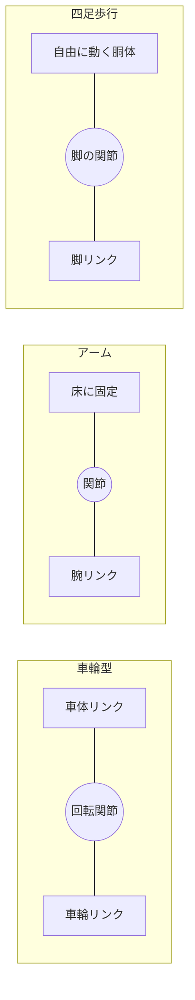
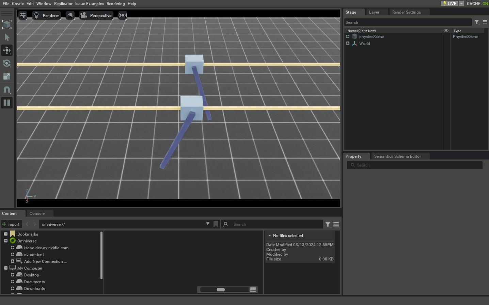
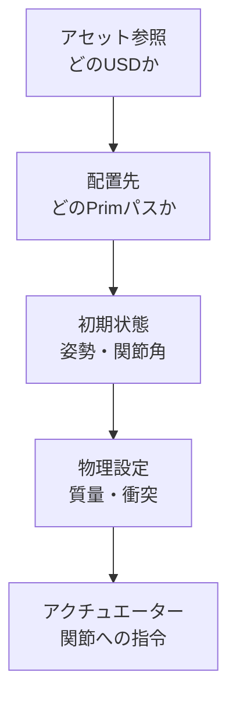
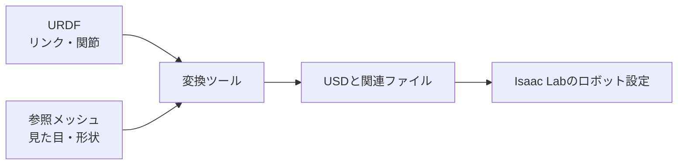
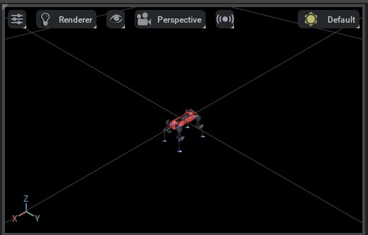

## 第5章 ロボットと環境の設定方法

### 5.1 場面の材料をそろえる

ロボットを置く前に、場面の材料を整理します。床は接触の相手、照明は見え方、ロボットのモデルは形と関節の情報を担当します。

場面に物体を追加することを「スポーン」と呼びます。アセットは、ロボットや物体などの再利用するデータです。設定を作り、その設定をもとにスポーンする、という順番で考えます。

床と照明を置くと、「起動できたが何も見えない」という状態から一歩進めます。次の短い例を、自分で作る`book_scene.py`という名前で`IsaacLab`フォルダーに保存してください。公式例の起動順序を参考にした、本書用の追加例です。GPU環境での実行確認はこれから行うものとします。

```python
import argparse
from isaaclab.app import AppLauncher

parser = argparse.ArgumentParser()
AppLauncher.add_app_launcher_args(parser)
args = parser.parse_args()
app_launcher = AppLauncher(args)
app = app_launcher.app

# シミュレーター関連の機能はアプリ起動後に読み込む。
import isaaclab.sim as sim_utils

sim = sim_utils.SimulationContext(sim_utils.SimulationCfg(dt=0.01))
ground = sim_utils.GroundPlaneCfg()
ground.func("/World/Ground", ground)
light = sim_utils.DomeLightCfg(intensity=3000.0)
light.func("/World/Light", light)
sim.set_camera_view([3.0, 3.0, 3.0], [0.0, 0.0, 0.0])

sim.reset()
print("床と照明の準備ができました")
try:
    while app.is_running():
        sim.step()
finally:
    app.close()
```

`import`は、ほかの機能を読み込む命令です。ここでは、アプリ起動前の読み込みと、起動後の読み込みを分けています。この順序は、普通の小さなPythonプログラムとは違う注意点です。

`dt=0.01`は、物理計算を進める時間幅を0.01秒にする設定です。シミュレーションの時間が一回でどれだけ進むかを表し、画面の毎秒表示回数を保証するものではありません。

UbuntuでもWindowsでも、`IsaacLab`フォルダーから次を実行できます。

```text
uv run --extra isaacsim python book_scene.py --viz kit
```

期待する結果は、照明のある床が表示されることです。`/World/Ground`と`/World/Light`がStage内にあるかも確認します。[公式の関節モデル例にある床と照明の生成](https://isaac-sim.github.io/IsaacLab/v3.0.0-EA/source/tutorials/01_assets/run_articulation.html)

**図5-1 場面を作る順序（概念図）**


床と照明の設定を追加した後、初期化と表示で結果を確かめる。

**未撮影の写真：写真5-1。** `book_scene.py`で床が見える画面を撮影し、StageのGroundとLightを囲む。空の場面の写真4-4と同じ大きさで並べ、何が追加されたかを比較できるようにする。

撮影時は、①対象のOSとIsaac Sim／Isaac Labの版、②実行したコマンドまたは画面操作、③撮影した時点、④画面で読める成功・失敗の根拠を記録する。画面上の実際の名前と本文の例が異なる場合は、キャプションを実画面に合わせる。

### 5.2 ロボットの種類

ロボットの種類によって、設定で注目する項目が変わります。

| 種類 | 代表的な動き | 設定で注目する項目 |
| --- | --- | --- |
| 車輪型 | 前進、旋回 | 車輪の半径、軸、回転方向、床との摩擦 |
| マニピュレーター | 腕を伸ばす、つかむ | 関節角度、可動範囲、土台の固定、先端位置 |
| 四足歩行 | 足を上げる、体を支える | 関節軸、接地、質量、胴体の自由な動き |
| ヒューマノイド | 二足で立つ、歩く | 多数の関節、姿勢、接地、バランス |

マニピュレーターは、物体へ働きかける腕型のロボットです。ロボットを構成する部品は「リンク」、リンク同士をつなぐ可動部分は「ジョイント」、つまり関節と呼びます。

関節でつながった物体のまとまりを、Isaac LabではArticulationとして扱います。見た目のメッシュが一つあるだけでは、関節モデルとは限りません。メッシュは、表面の形状を表すデータです。

**図5-2 リンクと関節（概念図）**



リンクは部品、関節は部品同士の動き方を決める接続である。

### 5.3 まず公式の関節モデルを動かす

最初の関節モデルには、公式のCartpoleを使います。Cartpoleは、台車に棒を取り付けたモデルです。人型や四足型より構造が少なく、関節やリセットの流れを追いやすくなります。

Ubuntuでは、`IsaacLab`フォルダーから次を実行します。

```bash
uv run --extra isaacsim python scripts/tutorials/01_assets/run_articulation.py --viz kit
```

Windowsのコマンドプロンプトでは、次を実行します。

```bat
uv run --extra isaacsim python scripts\tutorials\01_assets\run_articulation.py --viz kit
```

対象タグのソースでは、二つのCartpoleを配置し、ランダムな関節への力を与え、一定ステップごとにリセットします。期待する結果は、床上でモデルが動き、リセットの表示が繰り返されることです。棒を直立させる学習ではありません。[公式の関節モデル例](https://isaac-sim.github.io/IsaacLab/v3.0.0-EA/source/tutorials/01_assets/run_articulation.html)

**写真5-2 公式資料の参考画面：二つのCartpole**



左のViewportで2台の台車と棒を、右のStageで`World`を確認する。[公式チュートリアルの掲載画像](https://isaac-sim.github.io/IsaacLab/v3.0.0-EA/source/tutorials/01_assets/run_articulation.html)であり、本書の指定環境で実行した結果ではない。これは関節モデルの動作確認例で、学習済み方策の成果ではない。

**本書用の撮影手順：** 2台が欠けない視点で、台車の移動関節と棒の回転関節を実際のStage名に合わせて示す。端末の実行コマンドと版を記録する。

**写真5-3 撮影手順：リセット前後**

同じ視点と画面サイズで直前・直後を二枚撮る。端末の`Resetting robot state`と時刻を添え、姿勢とログの両方から初期状態へ戻ったことを確かめる。

### 5.4 設定を読む

公式サンプルでは、用意された設定をコピーし、配置先を変更しています。次は、その考え方を示す抜粋です。単独で実行するコードではなく、起動済みアプリ内の場面を作る処理に置くものです。

```python
from isaaclab_assets import CARTPOLE_CFG

robot_cfg = CARTPOLE_CFG.copy()
robot_cfg.prim_path = "/World/Robot"
```

`CFG`はconfiguration、設定を表す名前として使われています。`copy()`で元の設定をコピーすると、自分の変更を別の設定として扱えます。`prim_path`は、Stage内の配置先です。

公式サンプルには`/World/Origin.*/Robot`という指定があります。これは正規表現で、複数の配置先に一致させるためのものです。正規表現は、文字列のパターンを表す書き方です。初めは「一つの住所を指す指定」と「複数に一致する指定」を区別するだけで十分です。

設定を調べるときは、次の項目を順に読みます。

1. どのUSDアセットを読み込むか。

2. どこへ置くか。

3. 初期位置と関節の初期状態。

4. 質量、衝突、関節の物理設定。

5. 関節を動かす仕組みと、その制限。

関節を動かす装置や、そのモデルを「アクチュエーター」と呼びます。実機のモーターが無限の力を出せないように、シミュレーションでも力や速度の制限を扱います。[公式のアセット設定ガイド](https://isaac-sim.github.io/IsaacLab/v3.0.0-EA/source/how-to/write_articulation_cfg.html)

**図5-3 ロボット設定の五つの層（概念図）**



見た目が表示された後も、初期姿勢、物理、アクチュエーターを別々に確かめる。

### 5.5 外部ロボットモデルを取り込む

外部のロボットモデルでよく使われる形式にURDFがあります。URDFはUnified Robot Description Formatの略で、リンク、関節、形状の参照、質量などを記述する形式です。

MJCFは、MuJoCoというシミュレーターで使われるモデル形式です。STLやOBJなどのメッシュ形式は主に表面の形状を表し、必要な関節情報や質量がそろっているとは限りません。

Isaac Labの公式ガイドには、URDFやMJCFをUSDへ変換する方法があります。ここでは本書のIsaac Sim構成を維持し、URDFの変換ツールを使う例を示します。先に自分のモデルと参照するメッシュを用意します。

```text
uv run --extra isaacsim python scripts/tools/convert_urdf.py --help
```

`--help`で入力形式とオプションを確認します。起動処理が入るツールでは、ヘルプでも実行環境の準備が走ることがあります。次は実際に出力ファイルを書き込む例です。パスは自分のファイルへ置き換えてください。

```text
uv run --extra isaacsim python scripts/tools/convert_urdf.py path/to/robot.urdf path/to/output_dir
```

既定の変換設定が、自分のロボットに適しているとは限りません。固定土台か自由な土台か、関節をどう扱うか、駆動の設定は何かをヘルプと公式ガイドで確かめます。たとえば、固定関節を結合する設定は、元の階層や参照するリンク名に影響することがあります。

Isaac Sim 6ではURDF importerの仕組みが更新されています。古い記事のC++バインディング経由の呼び出しや`make_instanceable`の設定を、そのまま移植しないようにします。[対象版のアセット変換ガイド](https://isaac-sim.github.io/IsaacLab/v3.0.0-EA/source/how-to/import_new_asset.html)

変換後は、生成されたUSDをIsaac Simで開き、Stageとプロパティを確認します。プロパティは、選択した物体の設定値を表示する欄です。保存されたUSDが参照するメッシュなども、まとめて管理してください。

**図5-4 URDFからIsaac Labへ（概念図）**



URDFが参照するメッシュも変換時に必要。USDが生成された後に配置と物理設定を確認する。

**写真5-4 撮影手順：URDFの変換**

入力URDF、参照メッシュ、出力先、実行コマンドを端末画面に残す。出力フォルダーの実ファイル一覧も撮り、USDと関連ファイルの有無を確認する。架空のファイル一覧を成功例として使わない。

**写真5-5 公式資料の参考画面：変換後のモデル**



[公式のURDF変換チュートリアル](https://isaac-sim.github.io/IsaacLab/v3.0.0-EA/source/how-to/import_new_asset.html)の参考画像。モデル表示の例であり、本書のURDFを変換した証拠ではない。画像が小さいため、関節軸、制限、質量の値を読み取る資料には使わない。

**本書用の撮影手順：** 生成USDを開き、Stageで関節またはリンクを選ぶ。Propertyの関節軸、制限、質量をそれぞれ読める倍率で撮る。画面ラベルと操作順は撮影したIsaac Sim 6.1の表示に合わせる。

### 5.6 見た目と物理を分けて確認する

見た目が整ったロボットでも、物理設定が不適切なら正しく動きません。表示用の形状と、衝突判定に使う形状が違うこともあります。

衝突形状は、接触を計算するための形です。見た目の細かな形状をすべて使うより、単純な形状で近似することがあります。質量は重さに関わり、慣性は回転しにくさに関わります。摩擦は、床と足や車輪の滑り方に関係します。

確認は、停止した状態で大きさと配置を見て、次に物理を動かし、最後に小さな指令を与える順で進めます。最初から大きな力を入れると、設定の問題を見分けにくくなります。

| 現象 | 調べる候補 |
| --- | --- |
| 床をすり抜ける | 床とロボットの衝突設定、接触対象 |
| 開始直後に大きく跳ねる | 初期状態の食い込み、関節設定、時間幅 |
| 車輪が逆向きに回る | 関節軸、正方向、左右の対応 |
| 腕の土台ごと倒れる | 固定土台と自由な土台の設定 |
| 足が滑り続ける | 摩擦、接触形状、指令、質量 |
| 1000倍ほど大きさが違う | メッシュの単位、変換時のスケール |

この表は、原因を断定するものではありません。候補を一つずつ調べ、変更前後の結果を残します。

**未撮影の写真：写真5-6。** 衝突形状の表示を有効にした実画面を撮り、足または車輪の見た目と衝突形状を比較する。表示方法は撮影版のUIで確認し、キャプションに操作順を記録する。

撮影時は、①対象のOSとIsaac Sim／Isaac Labの版、②実行したコマンドまたは画面操作、③撮影した時点、④画面で読める成功・失敗の根拠を記録する。画面上の実際の名前と本文の例が異なる場合は、キャプションを実画面に合わせる。

### 5.7 ロボットの制御と学習を分ける

ロボットを関節指令で動かすことと、方策を学習することは別の段階です。まず一つの関節や台車に指令を与え、期待する方向へ動くかを確認します。その後、観測、行動、報酬、終了条件をそろえて、学習のタスクへ進みます。

物理計算が0.01秒ごとでも、行動を毎回更新するとは限りません。たとえば物理を4回進めるごとに行動を更新すれば、行動の更新間隔は0.04秒になります。この回数をdecimationと呼ぶ構成があります。学習や実機への移行では、この時間関係もそろえます。

次の表を一度書くと、タスクの不足が見つけやすくなります。

| 項目 | 自分のタスクで書くこと |
| --- | --- |
| 観測 | 何を、どの順番、単位、座標系で渡すか |
| 行動 | 力、速度、角度のどれを指示するか |
| 報酬 | 目的へ近づいたことをどう評価するか |
| 終了 | 成功、失敗、時間上限をどう決めるか |
| リセット | どの姿勢や位置から再開するか |
| 評価 | 学習の報酬以外に何を測るか |

この初稿では、この表を理解するところまでを扱います。具体的なTurtleBot3とBittleのタスク設計は、第6・7章に追加する内容です。

### 5.8 チェックポイント

- [ ] 床と照明を追加する処理を読める。

- [ ] Cartpoleの動作を、学習済み方策と区別して確認できる。

- [ ] リンク、関節、Articulation、アクチュエーターの意味がわかる。

- [ ] URDFと参照メッシュをまとめて管理できる。

- [ ] 表示形状、衝突形状、質量、関節軸を別々に確認できる。

- [ ] 変更する項目を一つに絞り、結果を比べられる。

