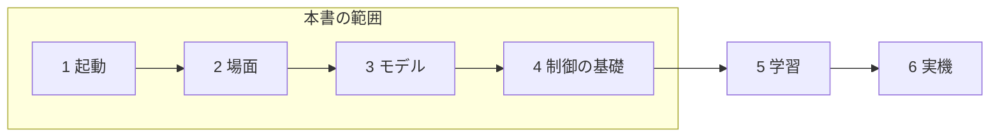
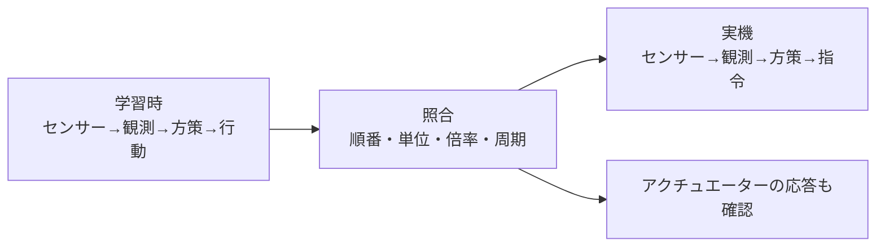

## 第8章 まとめと今後の展望

### 8.1 ここまでに学んだこと

本書では、シミュレーションが力や接触を計算すること、強化学習が観測と行動の経験から方策を改善することを学びました。さらに、Isaac LabとIsaac Simの役割を分け、対応するソースを取得し、空の場面から床、照明、関節モデルへ進む手順を確認しました。

ロボット学習では、難しいアルゴリズムだけが重要なのではありません。どの版を使ったか、モデルの関節はどう定義されているか、単位は何か、どの順番で状態を読むか。こうした土台を確認できることが、実験を進める力になります。

うまく動かなかったときも、すべてを一度に作り直す必要はありません。「起動」「アセットの読み込み」「物理」「指令」「観測」「学習」のどこまで確認できたかを戻って調べます。

**図8-1 学びの段階（概念図）**



本書の到達点は制御の基礎まで。学習と実機は次の段階として扱う。

### 8.2 次は小さな学習タスクへ進む

次の学習では、公式のCartpoleなど、構造の小さいタスクを選びます。まず観測と行動の内容を読み、終了条件と報酬を確認します。自分でロボットを取り込む前に、公式タスクの結果を再現できると、後の問題を分けやすくなります。

学習ライブラリは、PPOなどの計算を担当するソフトです。Isaac Labの対応ライブラリにはRSL RL、SKRLなどがあります。ライブラリとタスクで設定名や保存形式が異なるため、最初は公式の一つの組み合わせを使います。

学習後に保存された方策を読み込み、評価する段階を「推論」と呼びます。学習は方策を更新する処理、推論は方策を使って行動を選ぶ処理です。

初めての学習では、短い動作確認から始めます。ログが保存されるか、環境がリセットされるか、方策の保存と読み込みができるかを確認してから、長い学習へ進みます。[対象版のQuickstart](https://isaac-sim.github.io/IsaacLab/v3.0.0-EA/source/setup/quickstart.html)

**未撮影の写真：写真8-1。** 次の稿で学習を実行した際に、報酬の推移と評価時の動作を並べる。横軸、縦軸、試行条件、保存した方策の識別情報を記す。未測定の曲線は掲載しない。

撮影時は、①対象のOSとIsaac Sim／Isaac Labの版、②実行したコマンドまたは画面操作、③撮影した時点、④画面で読める成功・失敗の根拠を記録する。画面上の実際の名前と本文の例が異なる場合は、キャプションを実画面に合わせる。

### 8.3 Sim-to-Realで何が変わるか

Sim-to-Realは、シミュレーションで作った方策や制御を、実際のロボットへ移すことです。仮想空間と実機の差を「リアリティギャップ」と呼びます。

現実には、モーターの応答の遅れ、センサーの誤差、通信の遅れ、部品の個体差があります。床の摩擦やバッテリーの状態も変わります。画面上で歩いた方策を、そのまま実機へ送れば必ず歩く、という関係ではありません。

移行で最初にそろえるのは、方策の入力と出力です。関節の順番、角度の単位、姿勢の表現、観測の正規化、指令の倍率、制御周期が違うと、同じ方策でも別の意味になります。正規化は、値の範囲や尺度をそろえる処理です。

| 確認項目 | 食い違いの例 |
| --- | --- |
| 関節の順番 | 左前脚と右前脚が入れ替わる |
| 単位 | 度の値をラジアンとして渡す |
| 座標系 | 本体の速度へワールドの速度を渡す |
| 観測の処理 | 学習時の正規化を省く |
| 行動の意味 | 角度の増分を絶対角度として使う |
| 時間 | 学習時と実機の更新周期が違う |

公式の実機移行資料では、方策の入出力や配置先の環境を扱っています。実機の手順を始める際は、使用する機体に対応する資料も合わせて確認します。[公式のSim2Real資料](https://isaac-sim.github.io/IsaacLab/v3.0.0-EA/source/policy_deployment/index.html)

**図8-2 Sim-to-Realで照合する項目（概念図）**



入出力の順番、単位、倍率、周期を学習時と実機で照合する。

### 8.4 条件の変化を学習へ含める

ドメインランダマイゼーションは、学習中に質量、摩擦、観測の誤差などの条件を変える方法です。ひとつの条件だけに適応しすぎることを避け、条件が違っても動ける方策を目指します。

ただし、何でも大きく変えればよいわけではありません。実機から離れすぎた条件を大量に加えると、課題が必要以上に難しくなることがあります。まず実機や想定する環境を調べ、変動する範囲を考えます。

もう一つの工夫がカリキュラム学習です。簡単な条件から始め、達成状況に応じて難しくします。たとえば平らな床で動きを確認してから、段差や外乱を増やします。外乱は、外から受ける予期しない力や変化です。

こうした方法は、土台の物理設定や入出力の不一致を直す代わりにはなりません。基礎の確認を終えた後に、一つずつ加えて効果を測りましょう。

### 8.5 公式資料とコミュニティの使い方

調べる順番は、対象版の公式ページ、公式ソース、既知の問題、コミュニティの順がおすすめです。検索で見つかった手順は、対象のIsaac LabとIsaac Simが一致しているかを最初に確認します。

質問では、目的、実行したコマンド、環境、期待結果、実際の結果をまとめます。エラーは文章だけでなく、コピーできるテキストとして残すと、調べやすくなります。

```text
やりたいこと：空の場面サンプルを起動したい
OSとGPU：
ドライバー：
Isaac Labのタグとコミット：
Isaac SimとPythonの版：
実行した場所とコマンド：
期待した結果：
実際の結果とエラー：
これまでに確認したこと：
```

Isaac LabのGitHub Discussionsは質問や相談、Issuesは再現できる不具合の報告などに使われています。Isaac SimについてはNVIDIA Developer Forumsも参照できます。[公式リポジトリの案内](https://github.com/isaac-sim/IsaacLab#support)

### 8.6 最後のチェックポイント

- [ ] 本書の起動手順を、自分の環境情報と合わせて記録した。

- [ ] 観測、行動、報酬、終了条件の表を書ける。

- [ ] 学習と推論を区別できる。

- [ ] Sim-to-Realで合わせる入力と出力を説明できる。

- [ ] 次に読む公式サンプルを一つ選んだ。

ロボット学習の最初の一歩は、自分が何を設定し、何を確かめたかを説明できるようになることです。空の場面が起動したら、床を追加する。モデルが見えたら、関節を調べる。その積み重ねを、次の学習タスクへつなげていきましょう。

