# NVIDIA Isaac Labではじめるロボット学習 初稿

Pythonを少し触った人のためのシミュレーション入門

仕様確認日：2026年10月4日

## はじめに

ロボットに「歩いて」と伝えるだけで、足が自然に動くわけではありません。どの関節をどれくらい動かすか、体が傾いたときにどう立て直すか、床が滑ったときにどう対応するか。ロボットを動かすには、たくさんの判断が必要です。

その判断の方法を、試行錯誤から学ばせる技術がロボット学習です。本書では、NVIDIA Isaac Labを使うための基礎を、Pythonの短い例と画面の見方を交えながら学びます。

最初の目標は、優秀な歩行ロボットを作ることではありません。「シミュレーターが起動する」「床と照明を置ける」「ロボットの関節や設定を読み取れる」という、小さな成功を順に積み重ねます。これができると、公式サンプルのどこを変更すればよいか、自分で見当をつけられるようになります。

この初稿には第1〜5章と第8章を収録しています。第6章のTurtleBot3、第7章のBittleによるハンズオンは今回の範囲に含めず、将来追加するときのために章番号を残します。

**扉図 学習の進め方（概念図）**

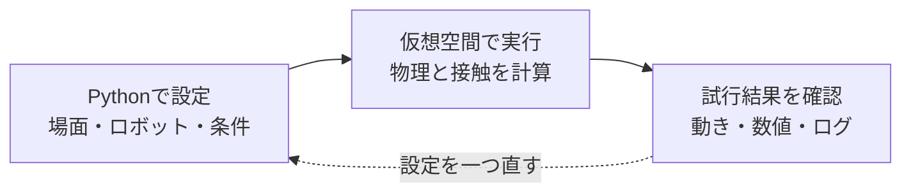

設定、実行、確認を一周として繰り返す。

## 対象読者と前提知識

本書は、Pythonで変数、`if`、`for`、関数を一度は使ったことがある人を対象にしています。ロボット工学や強化学習を学んだ経験は必要ありません。

たとえば、次のコードの意味がなんとなくわかれば、読み始められます。

```python
def is_near_goal(distance):
    return distance < 0.1

for distance in [1.0, 0.5, 0.05]:
    print(distance, is_near_goal(distance))
```

`distance`は目標までの距離です。0.1より小さければ、`True`、つまり「条件を満たしている」と判定します。本書でも、数値や条件を使ってロボットと環境を設定します。

コマンドを入力する画面は、Linuxでは「端末」、Windowsでは「コマンドプロンプト」などと呼ばれます。これらをまとめてターミナルと呼びます。コードを編集するソフトはエディターです。どちらも、画面を見ながら少しずつ慣れていけば大丈夫です。

本書の実行手順は、NVIDIA RTX GPUを搭載したUbuntuまたはWindowsのコンピューターを前提にします。GPUは、多くの計算を並行して処理する装置です。Macは本文の作成やコードの閲覧には使えますが、本書のIsaac Sim実行環境には含めません。Macから取り組む場合は、対応する別のPCやリモートGPU環境を用意します。

## 本書の版と読み方

Isaac LabとIsaac Simは別の製品で、それぞれにバージョンがあります。同じ数字にそろえればよいという関係ではありません。

確認時点の公式リポジトリでは、Isaac Labの`v3.0.0-EA`タグがIsaac Sim 6.1に対応しています。EAはEarly Access、つまり先行公開版を意味します。公式の3.0系列の導入ページには、配布Pythonパッケージとして`3.0.0rc1`も記載されています。rcは正式版候補を表します。本書は、この先行公開系列のソースをタグで固定して説明します。正式版としての安定性や、すべてのサンプルの動作を保証するものではありません。[公式の対応表](https://github.com/isaac-sim/IsaacLab#isaac-sim-version-dependency)、[対象版の導入手順](https://isaac-sim.github.io/IsaacLab/v3.0.0-EA/source/setup/installation/index.html)

| 本書で扱う項目 | 基準 |
| --- | --- |
| Isaac Labのソース | `v3.0.0-EA`タグ |
| Isaac Sim | 6.1系列 |
| Python | 3.12 |
| 主なOS | Ubuntu 22.04／24.04、Windows 11のx86_64環境 |
| 導入方法 | `uv`によるソース環境の管理 |
| 画面表示 | Isaac Simを使うKitの画面 |

`develop`は開発中のブランチ、つまり日々変更されるソースの系列です。本文ではこれを直接使いません。また、2.x系列の記事にあるPythonや関節操作のコードを、3.0系列へそのまま混ぜないようにします。

Omniverseは、NVIDIAの3Dシミュレーションに関わる技術基盤です。本書ではOmniverse Launcherを経由するインストールを使いません。現在の公式導入経路に沿って、必要なソフトを取得します。

本文の図は理解を助ける概念図です。「公式資料の参考画面」はNVIDIA公式チュートリアルの掲載画像であり、本書の指定環境で撮影した結果ではありません。実行コマンドは公式資料と公開ソースを照合しましたが、この初稿ではIsaac Lab `v3.0.0-EA`とIsaac Sim 6.1の組み合わせをGPUで実行確認していません。未撮影の写真には、撮影時に確かめる項目を残しています。

## 目次

- 第1章 本書の目的

- 第2章 知っておくべき基礎知識

- 第3章 NVIDIA Isaac Labとは

- 第4章 環境構築

- 第5章 ロボットと環境の設定方法

- 第6章 ハンズオン実践2 Bittle 今回は未収録

- 第7章 ハンズオン実践1 TurtleBot3 今回は未収録

- 第8章 まとめと今後の展望

- 付録 次に読む公式リソース

- 付録 図版制作と実行確認の記録

## 第1章 本書の目的

### 1.1 仮想空間でロボットを試す

シミュレーションとは、現実の仕組みをコンピューター上で再現して、結果を調べることです。ロボットのシミュレーターでは、床、物体、関節、重力などを設定し、ロボットがどのように動くかを計算します。

画面にロボットの姿を描くだけなら、3Dアニメーションでもできます。シミュレーションで大切なのは、その裏側で力や接触を計算していることです。足が地面を押せば体が動き、重心が支えから外れれば倒れる。こうした関係を計算する仕組みを、物理エンジンと呼びます。

仮想空間なら、転倒したロボットを元の姿勢へ戻して、すぐに次の試行を始められます。ただし、現実を完全に再現できるわけではありません。摩擦、部品のたわみ、通信遅延などは、モデル化の仕方によって結果が変わります。

**図1-1 試行のやり直し（概念図）**

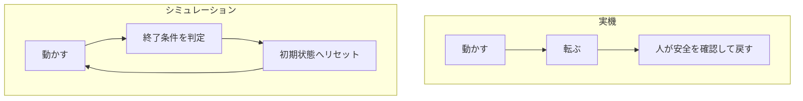

実機では人が安全を確認して戻す。シミュレーションでは終了条件に従い状態を戻せる。

### 1.2 Isaac Labで何を実現できるか

Isaac Labは、ロボット学習の実験環境を作るためのオープンソースのフレームワークです。フレームワークは、よく使う処理をまとめた開発の土台です。ロボットやセンサーを配置するだけでなく、観測、行動、報酬、リセットを組み合わせて学習の課題を作れます。[Isaac Lab公式概要](https://github.com/isaac-sim/IsaacLab)

たとえば、車輪型ロボットで目標地点へ近づく、アームで物体へ手を伸ばす、四足歩行ロボットで指定された速度に近づく、といった課題を考えられます。学習の課題を、以後「タスク」と呼びます。

タスクを作るときは、「ロボットに何を達成してほしいか」を具体的な数値や条件にします。「うまく歩く」だけでは曖昧です。「目標の前進速度に近づく」「倒れない」「関節を急激に動かしすぎない」と分けると、設定すべき項目が見えてきます。

この本では、タスクを完成させる前に、その材料を理解します。ロボットモデル、環境、センサー、設定ファイルがどう関係するかをつかむことが、後のハンズオンにつながります。

**図1-2 タスクの材料（概念図）**

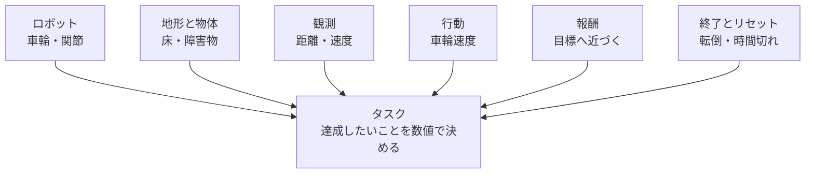

タスクはロボットだけでなく、環境、観測、行動、評価、終了条件を組み合わせて定義する。

### 1.3 読み終えたときの到達点

本書を読み終えたら、次のことを自分の言葉で説明できる状態を目指します。

- Isaac SimとIsaac Labが担当する役割。

- 観測を受け取って行動を返す、ロボット制御の流れ。

- 対応するバージョンを選び、公式サンプルを起動する方法。

- ロボットの見た目と、物理計算に必要な設定の違い。

- シミュレーションの結果を実機へ移すときに調べる項目。

ここではTurtleBot3のナビゲーションやBittleの歩行学習を完成させません。また、画面のロボットが動いたことと、学習が成功したことは分けて考えます。ランダムな力を与えてもロボットは動きますが、その動作は目標を達成する方策とは限りません。

**未撮影の写真：写真1-1。** 第5章の関節モデルのサンプルを起動し、モデル全体と床が見える画面を撮る。「これはモデルと物理計算の確認。学習済みの動作ではない」とキャプションを付ける。

撮影時は、①対象のOSとIsaac Sim／Isaac Labの版、②実行したコマンドまたは画面操作、③撮影した時点、④画面で読める成功・失敗の根拠を記録する。画面上の実際の名前と本文の例が異なる場合は、キャプションを実画面に合わせる。

### 1.4 チェックポイント

- [ ] シミュレーションで何を計算するかを説明できる。

- [ ] 作ってみたいタスクを一文で書ける。

- [ ] 「動いた」と「学習できた」を分けて考えられる。

つまずきポイント：最初から実機と同じロボットを用意しようとすると、モデル作成、物理設定、制御、学習が同時に問題になります。まず公式の小さなモデルを使い、起動と設定の読み方を覚えましょう。

## 第2章 知っておくべき基礎知識

### 2.1 強化学習の登場人物

強化学習は、行動の結果として得られる評価を手がかりに、行動の選び方を改善する方法です。ここでは、目標地点へ向かう小さな車輪型ロボットを例にします。

ロボットが走る床や壁を含む、試行の場を「環境」と呼びます。行動を選ぶ主体を「エージェント」と呼びます。エージェントは物理的な機体そのものではなく、機体に指示を出す計算の仕組みと考えるとわかりやすいでしょう。

エージェントに渡す情報が「観測」です。たとえば、目標までの方向、車輪の回転速度、障害物までの距離です。観測をもとに返す指示が「行動」です。左右の車輪速度や、関節の目標角度などを使います。

行動の結果を評価した数値が「報酬」です。目標に近づいたら加点し、衝突したら減点する、といった設計ができます。観測から行動を選ぶ規則を「方策」と呼びます。学習の目的は、長い目で見た報酬の合計を増やせる方策を見つけることです。

**図2-1 強化学習の一巡（概念図）**

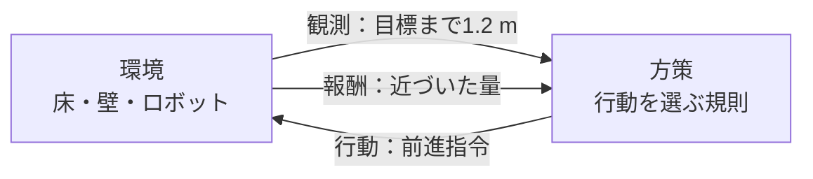

環境から得た観測を方策へ渡し、行動の結果として次の観測と報酬を受け取る。

### 2.2 1回の試行を区切る

観測を受け取り、行動し、環境を進める一巡を「ステップ」と呼びます。試行の開始から終了までのまとまりは「エピソード」です。

目標へ到達した、転倒した、制限時間になった、といった条件でエピソードを終えます。終了後に初期状態へ戻すことを「リセット」と呼びます。学習中は、これを繰り返して経験を集めます。

Pythonで考え方だけを表すと、次のようになります。この例は流れを説明するための疑似コードで、そのまま実行するIsaac Labのプログラムではありません。

```python
# 疑似コード。各関数の実装は省略しています。
observation = reset_environment()
while not episode_finished:
    action = policy(observation)
    observation, reward, episode_finished = step_environment(action)
```

実際の環境では、タスクの成否による終了と、時間上限による打ち切りを別に扱うことがあります。公式コードに`terminated`と`truncated`が出てきたら、どちらの理由で試行が終わったかを確認してください。

### 2.3 PPOは何をしているか

PPOはProximal Policy Optimizationの略で、方策を改善する強化学習アルゴリズムの一つです。アルゴリズムとは、問題を解くための手順です。

大まかには、現在の方策で経験を集め、予想より良かった行動の選ばれやすさを増やし、悪かった行動の選ばれやすさを減らします。このとき、方策を一度に変えすぎない工夫を使います。「良い方向へ修正するが、一回の修正で大きく崩さない」という考え方です。PPOにはいくつかの実装形がありますが、代表的なものは更新量を抑えるクリッピングを使います。[PPOの原論文](https://arxiv.org/abs/1707.06347)

ここでの「良かった」は、その瞬間の報酬だけでは決まりません。その後も含めてどれだけ報酬を得られたかを推定し、行動を評価します。今は少し遠回りしても、その後の衝突を避けられるなら、有益な行動になり得ます。

PPOが賢くても、ロボットに必要な観測がなければ判断できません。報酬の設計が目的とずれていれば、望まない動作が高く評価されることもあります。アルゴリズムを選ぶ前に、何を見せ、何を操作させ、何を評価するかを考えましょう。

**図2-2 PPOの反復 概念図（概念図）**

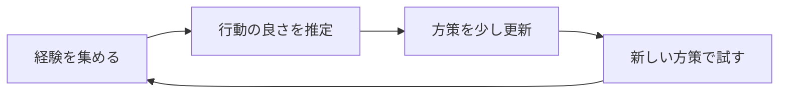

PPOの処理順を示す概念図であり、学習成績の測定結果ではない。

### 2.4 報酬を短いPythonで考える

次の例は普通のPythonだけで実行できます。距離はメートルとし、1ステップで目標に近づいた量を報酬にします。これは説明用の報酬で、完成したナビゲーション用タスクではありません。

```python
def reward_for_step(previous_distance, current_distance, collided):
    progress = previous_distance - current_distance
    collision_penalty = 1.0 if collided else 0.0
    return progress - collision_penalty

print(reward_for_step(2.0, 1.8, False))  # 約0.2
print(reward_for_step(2.0, 2.1, False))  # 約-0.1
print(reward_for_step(2.0, 1.8, True))   # 約-0.8
```

衝突の減点が大きすぎると、ロボットが動かなくなる可能性があります。逆に小さすぎると、ぶつかってでも目標へ近づく動作が選ばれるかもしれません。こうした違いを、動画と数値の両方で確認します。

「報酬が上がった」だけで成功としないことも大切です。目標到達率、衝突の回数、到達までの時間など、目的に直接関係する指標も記録します。

### 2.5 ロボットのセンサー

センサーは、周囲や自分の状態を測る装置です。シミュレーションでは、その測定結果を計算で再現します。

| センサー | 測るもの | 使い道と注意点 |
| --- | --- | --- |
| RGBカメラ | 赤・緑・青の画像 | 物体や周囲を見る。画像を処理する計算量が必要 |
| 深度カメラ | 各画素の距離 | 物体の形や距離を調べる。距離の単位を確認 |
| LiDAR | 光を使った距離計測 | 障害物や形状を調べる。方式や点群の座標系を確認 |
| IMU | 加速度と角速度など | 体の動きや姿勢推定に使う。取り付け向きや重力の扱いを確認 |
| 関節エンコーダー | 関節角度や回転位置 | 自分の関節の状態を知る。角度の単位に注意 |
| 接触センサー | 接触の有無や力など | 足が接地したかを調べる。対象物と接触の設定が必要 |

IMUはInertial Measurement Unit、慣性計測装置です。IMUが直接、誤差のない位置を教えてくれるわけではありません。測定値を使って姿勢や動きを推定します。

Isaac Labにはカメラ、IMU、接触センサー、Ray Casterなどの仕組みがあります。Ray Casterは仮想的な線を飛ばし、物体と交わる位置を調べる仕組みです。地形の高さを測る用途などに使えますが、RTX LiDARと同じセンサーとして扱うことはできません。対象物や対応するバックエンドを確認します。[公式のセンサー一覧](https://isaac-sim.github.io/IsaacLab/v3.0.0-EA/source/concepts/sensors/index.html)

**図2-3 センサーが測るもの（概念図）**

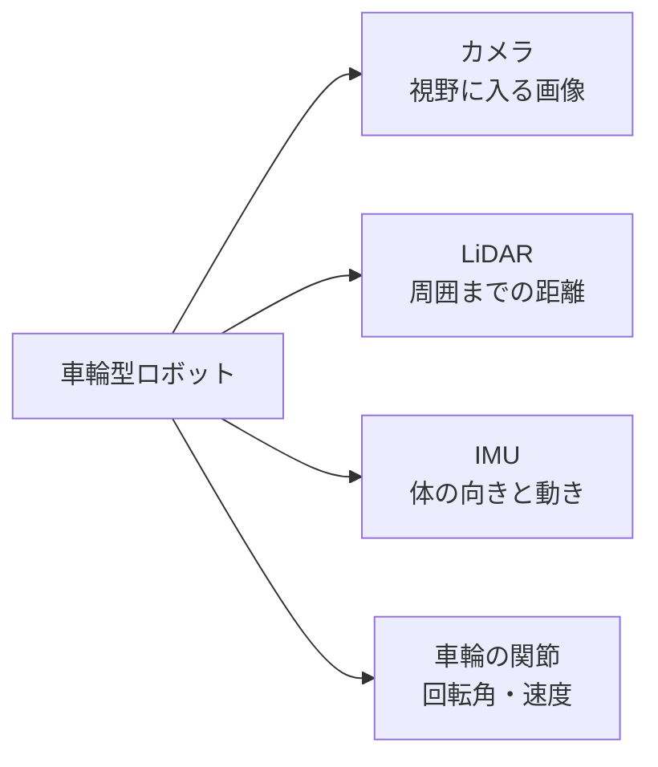

各センサーの情報は異なる。3D画面で見えるものが、そのままロボットの観測になるわけではない。

**未撮影の写真：写真2-1。** 後のセンサー学習時に、3D画面と実際のカメラ出力を左右に並べて撮る。画面を眺める視点と、ロボットが観測する視点が異なることを矢印で示す。未実装のセンサー出力を合成して実測画面に見せない。

撮影時は、①対象のOSとIsaac Sim／Isaac Labの版、②実行したコマンドまたは画面操作、③撮影した時点、④画面で読める成功・失敗の根拠を記録する。画面上の実際の名前と本文の例が異なる場合は、キャプションを実画面に合わせる。

### 2.6 単位と座標系

座標系は、位置や向きを数値で表すときの基準です。部屋全体を基準にしたワールド座標系と、ロボット本体を基準にした座標系では、同じ物体の位置でも数値が変わります。

ロボットが右を向くと、本体から見た「前」も右へ変わります。ワールドの前方向は変わりません。関数やデータに`world`、`body`などの名前が付いていたら、どの基準の値か確認します。

角度には度とラジアンがあります。ラジアンは、一周を約6.283として表す単位で、180度はπラジアンです。Pythonの`math.pi`を使うと、この変換を確かめられます。

```python
import math

degrees = 90.0
radians = math.radians(degrees)
print(round(radians, 3))  # 1.571
```

向きを4つの数で表すクォータニオンという形式もあります。4つの数の並びはAPIによって異なるため、順番を思い込みで決めないようにします。

**図2-4 座標系で方向が変わる（概念図）**

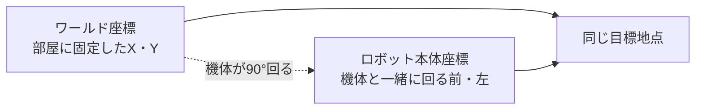

ワールド軸は部屋に固定され、本体軸はロボットと一緒に回る。

### 2.7 チェックポイント

- [ ] 観測、行動、報酬、方策を一つずつ例で説明できる。

- [ ] ステップとエピソードの違いがわかる。

- [ ] カメラ、LiDAR、IMUが何を測るかを説明できる。

- [ ] 角度と距離の単位、座標系を確認する習慣が付いた。

つまずきポイント：シミュレーター内部で読める正確な位置を、実機でも同じように取得できるとは限りません。学習に使う情報と、実機で測れる情報を分けて整理しましょう。

## 第3章 NVIDIA Isaac Labとは

### 3.1 Isaac SimとIsaac Labの役割

Isaac Simは、ロボットのシミュレーションに使うソフトウェアです。3Dの場面、物理計算、センサー、外部システムとの接続などを扱います。Isaac Labは、そのようなシミュレーションをロボット学習の実験へ組み立てるための仕組みを提供します。

本書ではIsaac Simを使う構成に絞って操作を説明します。ただし、Isaac Lab 3.0系列にはIsaac Simを起動せずに動くKit-less構成もあります。Kitは、Omniverseのアプリケーションを動かす基盤です。Kit-lessは、それを使わない実行方式を意味します。[公式のバックエンド説明](https://isaac-sim.github.io/IsaacLab/v3.0.0-EA/source/concepts/backends_and_presets.html)

したがって、「Isaac Labなら必ずIsaac Simの画面が開く」という理解では、現在の構成を説明しきれません。学習の計算、物理計算、センサー用の画像生成、人が確認する画面を分けて考えます。

**図3-1 本書で使う構成（概念図）**

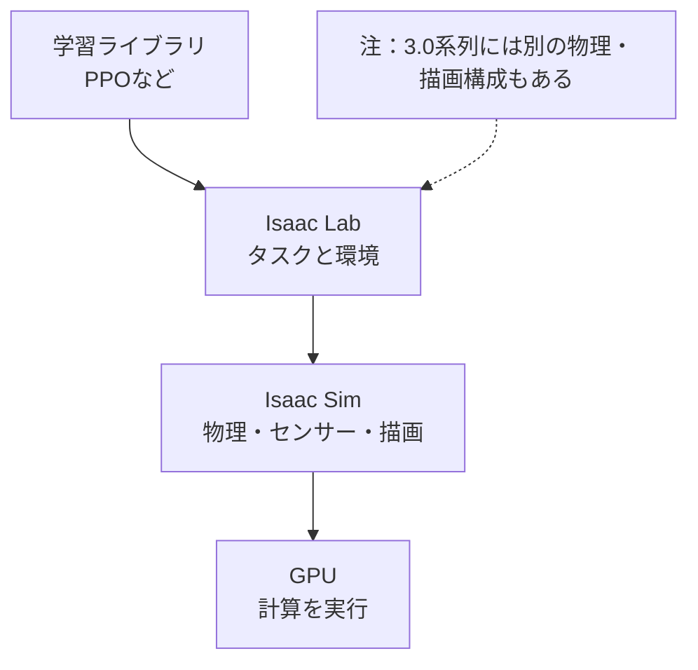

本書の画面付き手順はIsaac Simを使う構成を対象とする。

### 3.2 バックエンドという言葉

バックエンドは、表面の共通の操作の裏で、実際の仕事を担当する実装です。Isaac Lab 3.0では、物理計算や描画の実装を選ぶ構成があります。

物理計算は物体の動きを決め、レンダラーはセンサー用の画像などを生成します。ビジュアライザーは、人が様子を確認するための表示を担当します。この三つは役割が違います。画面表示を消しても、カメラを観測に使うタスクでは画像生成が必要になることがあります。

タスクのコマンドにある`physics=isaacsim_physx`は、物理の構成を選ぶ指定です。`--viz kit`は表示方法の指定です。ただし、使える組み合わせはタスクやスクリプトによって異なります。タスク用の指定を、すべての短いPythonスクリプトに付けられるわけではありません。

初めのうちは、公式サンプルの指定を維持しましょう。一度に物理エンジンと表示方法を変更すると、問題の原因を追いにくくなります。

### 3.3 USDで場面を記述する

USDはUniversal Scene Descriptionの略で、3Dの場面を記述し、複数のデータを組み合わせるための仕組みです。OpenUSDという名前でも目にします。

ロボットの形状だけでなく、物体の位置、材質、階層構造などを扱えます。Isaac Simの物理用の情報を加えると、質量、衝突、関節などの設定も持たせられます。ファイルがUSD形式であるだけで、正しいロボットの物理モデルになるわけではありません。[公式のアセット導入説明](https://isaac-sim.github.io/IsaacLab/v3.0.0-EA/source/how-to/import_new_asset.html)

開かれた場面全体は「Stage」と呼ばれます。Stageの中の各要素は「Prim」と呼ばれ、`/World/Robot`のようなパスで識別できます。パスは場面の中の住所です。ファイルの保存場所とは別のものです。

```text
/World
├── Ground
├── Light
└── Robot
    ├── Base
    └── Arm
```

これは説明用の階層です。実際のロボットの名前や構造はアセットごとに異なります。

**図3-2 Primのパスと3Dの対応（概念図）**

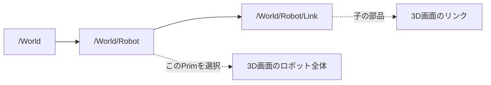

Primのパスは場面内の住所であり、Stageの階層と3D画面の物体を結び付ける。

**未撮影の写真：写真3-1。** ロボットのサンプルでStageパネルを開き、モデルの親Primを選択する。選択中のパス、階層、3D画面での選択状態を一枚に収める。本文の例と実際の名前が違う場合は、撮影画面の名前に合わせてキャプションを書く。

撮影時は、①対象のOSとIsaac Sim／Isaac Labの版、②実行したコマンドまたは画面操作、③撮影した時点、④画面で読める成功・失敗の根拠を記録する。画面上の実際の名前と本文の例が異なる場合は、キャプションを実画面に合わせる。

### 3.4 計算グラフと実行フロー

計算グラフは、処理を箱、データや実行のつながりを線で表したものです。「時刻を受け取る→センサー値を読む→外部へ送る」と描くと、処理の順番を追いやすくなります。

Isaac Simでは、OmniGraphを使って処理をノードで組み立てる方法があります。ノードは、一つの処理を担当する箱です。ただし、Isaac Labの学習処理を理解するために、最初からOmniGraphの画面でタスク全体を作る必要はありません。

本書ではPythonの実行フローを先に見ます。起動後に場面を作り、初期化し、繰り返しの中で指令を書き込み、物理計算を進め、更新後の状態を読む。この順番を理解すると、公式コードが読みやすくなります。[空の場面を作る公式例](https://isaac-sim.github.io/IsaacLab/v3.0.0-EA/source/tutorials/00_sim/create_empty.html)、[関節モデルを操作する公式例](https://isaac-sim.github.io/IsaacLab/v3.0.0-EA/source/tutorials/01_assets/run_articulation.html)

**図3-3 シミュレーションの実行順序（概念図）**

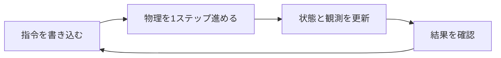

これは実行順序の説明図であり、OmniGraphの実画面ではない。

### 3.5 Manager-basedとDirect

Isaac Labには、タスクの処理を役割別に分けるManager-based方式と、タスクのクラスへ直接書くDirect方式があります。クラスは、関連するデータと処理をまとめるPythonの仕組みです。

Manager-based方式では、観測、行動、報酬などを担当する管理役へ分けます。報酬の項目を差し替えて比較するような場面で、構造を追いやすくなります。Direct方式では、処理の流れを一つのクラスの中で追いやすい一方、自分で扱う範囲が増えます。[公式のタスク設計方式](https://isaac-sim.github.io/IsaacLab/v3.0.0-EA/source/concepts/task_workflows.html)

どちらかが、すべての初心者にとって簡単というわけではありません。最初は読んでいるサンプルと同じ方式を使い、途中で方式を変えずに一つの流れを理解しましょう。

**図3-4 タスクのコードの分け方（概念図）**

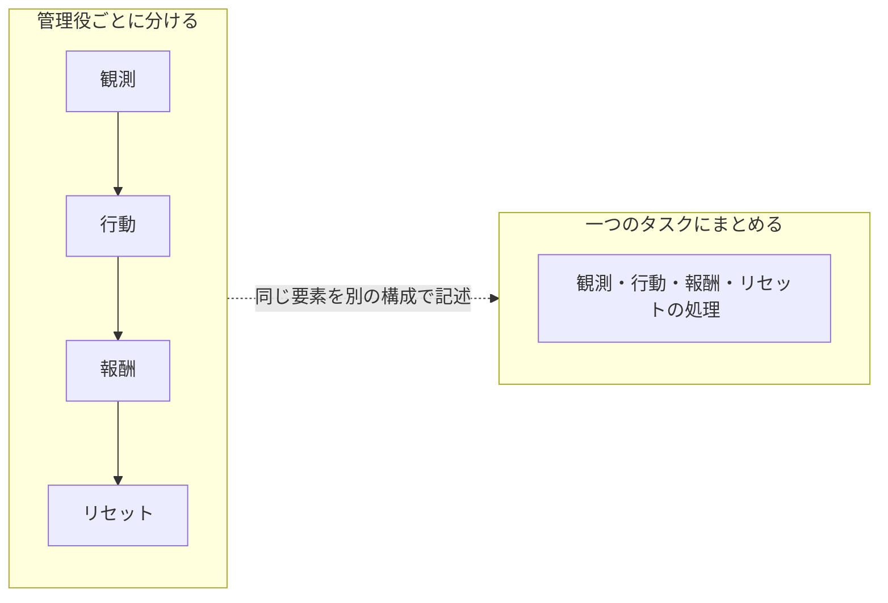

観測、行動、報酬、リセットという材料は同じで、コードの置き方が異なる。

### 3.6 チェックポイント

- [ ] 本書がIsaac Simを使う構成であるとわかる。

- [ ] 物理計算、画像生成、確認用の画面を区別できる。

- [ ] Primのパスとファイルのパスを区別できる。

- [ ] Pythonのループと計算グラフの役割を説明できる。

つまずきポイント：古い資料では`omni.isaac.lab`などの名前が出てくることがあります。本書の`isaaclab`と混ぜず、資料の対象バージョンと移行ガイドを確認してください。

## 第4章 環境構築

### 4.1 まず実行環境を確認する

インストールは、対応しているOSとGPUを確認してから始めます。GPUが付いているだけでは十分ではありません。Isaac Simの画面やRTX機能には、対応するNVIDIA GPUが必要です。

確認時点のIsaac Sim公式要件表は、x86_64環境について次の値を掲載しています。これは要件表の基準であり、すべての学習タスクがこの構成で余裕を持って動くという意味ではありません。[Isaac Sim公式要件](https://docs.isaacsim.omniverse.nvidia.com/latest/installation/requirements.html)

| 項目 | 公式要件表の最低構成 |
| --- | --- |
| OS | Ubuntu 22.04／24.04、Windows 11 |
| CPU | Intel Core i7 第7世代、またはAMD Ryzen 5を基準に掲載 |
| CPUコア | 4 |
| メモリー | 32 GB |
| ストレージ | 50 GB SSD |
| GPU | GeForce RTX 4080 |
| GPUメモリー | 16 GB |
| テスト済みドライバー | Linux 595.58.03、Windows 595.97 |

GPUメモリーをVRAMと呼びます。通常のメモリーとは別の容量です。カメラや並列環境を増やすと、RAMとVRAMの両方が多く必要になることがあります。50 GBは学習ログや追加アセットの容量を十分に見込んだ値ではないため、作業用の空き容量にも余裕を持たせます。

公式のIsaac Lab導入ページに掲載されたドライバー推奨値と、Isaac Simの要件表にあるテスト済み値には差があります。本書では低い数値だけを満たせばよいと判断せず、使用するIsaac SimとGPUに対応する現行のProduction Branchドライバーを選び、Compatibility Checkerで確認します。Compatibility Checkerは、環境の互換性を調べる公式ツールです。

CPUやメモリーが強力でも、対応外のGPUを補うことはできません。公式要件ではRT Coreを持たないA100やH100は、Isaac Simの対象外です。クラウドでも、GPUの名前を確認してから選びます。

**未撮影の写真：写真4-1。** 公式要件ページのOS、RAM、GPU、VRAM、ドライバーの行を撮影する。ページの対象バージョンと取得日を欄外に記録する。本文の要件表と撮影時の値が一致するか確認する。

撮影時は、①対象のOSとIsaac Sim／Isaac Labの版、②実行したコマンドまたは画面操作、③撮影した時点、④画面で読める成功・失敗の根拠を記録する。画面上の実際の名前と本文の例が異なる場合は、キャプションを実画面に合わせる。

### 4.2 この章で使う導入方法

本書は`uv`を使い、Isaac Labのソース一式から実行します。uvは、Pythonの実行環境と必要なパッケージを管理するツールです。プロジェクトの指定に基づいて環境を用意するため、異なる用途のPython環境を混ぜにくくなります。

公式の対象版では、この自動セットアップが推奨されています。`--extra isaacsim`は、追加機能としてIsaac Simを環境へ含める指定です。`all`だけを指定しても、Isaac Simが含まれるとは限りません。[対象版のインストール案内](https://isaac-sim.github.io/IsaacLab/v3.0.0-EA/source/setup/installation/index.html)

以下の手順は、読み取り確認とインストールを分けて記します。掲載コマンドを、対応GPUのPCで順に実行してください。この原稿を読むだけなら、今のPCへインストールする必要はありません。

### 4.3 手順1 GPUと基本ツールを確認する

Ubuntuの端末、またはWindowsのコマンドプロンプトで実行します。次の二つは確認用で、インストールはしません。

```text
nvidia-smi
git --version
```

`nvidia-smi`は、GPUの名前、ドライバー、メモリー使用量などを表示します。見つからない、GPUが認識されない、といった場合は、先にドライバーの問題を解決します。

Gitは、ソースコードの履歴を管理し、公開リポジトリを取得するツールです。リポジトリは、ソースコードと履歴をまとめた保管場所です。`git --version`が失敗する場合は、OSに対応するGitを用意します。

UbuntuではOSとGLIBCも確認します。GLIBCはLinuxでプログラムを動かす基本ライブラリで、Isaac SimのPython配布には2.35以上が必要です。

```bash
cat /etc/os-release
ldd --version
```

**未撮影の写真：写真4-2。** `nvidia-smi`の結果を撮る。GPU名、Driver Version、Memory Usageの3か所を囲む。右上のCUDA Versionは、このドライバーが対応できるCUDAの目安であり、別途インストールしたCUDA Toolkitの版を示す値と決めつけない。

撮影時は、①対象のOSとIsaac Sim／Isaac Labの版、②実行したコマンドまたは画面操作、③撮影した時点、④画面で読める成功・失敗の根拠を記録する。画面上の実際の名前と本文の例が異なる場合は、キャプションを実画面に合わせる。

### 4.4 手順2 uvを用意する

ここからはソフトをインストールします。Ubuntuでは公式インストーラーを使います。取得したスクリプトを実行するコマンドです。

```bash
curl -LsSf https://astral.sh/uv/install.sh | sh
```

Windowsでは、公式のIsaac Lab手順に従い、コマンドプロンプトで次を実行します。

```bat
powershell -ExecutionPolicy ByPass -c "irm https://astral.sh/uv/install.ps1 | iex"
```

インストール後、新しい端末を開き、次の確認をします。

```text
uv --version
```

Windowsでは長いファイルパスが問題になることがあります。対象版の公式手順は、取得前にWindowsの長いパスを有効にするよう案内しています。管理者として開いたPowerShellで、次を実行します。これはOSの設定を書き換える操作です。

```powershell
New-ItemProperty -Path "HKLM:\SYSTEM\CurrentControlSet\Control\FileSystem" -Name LongPathsEnabled -Value 1 -PropertyType DWORD -Force
```

実行後は新しいコマンドプロンプトを開いて、次の手順へ進みます。組織で管理されているPCは、管理者の定めた手順に従います。

### 4.5 手順3 公開タグを固定して取得する

ソースを保存したい作業フォルダーで、次を実行します。`IsaacLab`というフォルダーを新しく作り、公開ソースを取得します。同名の既存フォルダーがある場合は、新しい別の作業場所を使ってください。

```text
git clone --branch v3.0.0-EA https://github.com/isaac-sim/IsaacLab.git
cd IsaacLab
git describe --tags --always
git rev-parse HEAD
```

最後の二つは確認用です。表示されたタグとコミットを記録します。コミットは、ソースの特定の状態を識別するものです。「最新版」という言葉より、具体的なタグとコミットがあるほうが、後から同じ状態を調べやすくなります。

タグを取得すると、Gitがdetached HEADという案内を出すことがあります。特定の版を読む目的なら、それだけで失敗ではありません。自分の変更を履歴に残す場合は、別途作業ブランチを作ります。

**未撮影の写真：写真4-3。** `git describe`と`git rev-parse HEAD`の結果を撮る。タグとコミットを囲み、「本書の撮影環境を再現する情報」と添える。

撮影時は、①対象のOSとIsaac Sim／Isaac Labの版、②実行したコマンドまたは画面操作、③撮影した時点、④画面で読める成功・失敗の根拠を記録する。画面上の実際の名前と本文の例が異なる場合は、キャプションを実画面に合わせる。

### 4.6 手順4 空のシミュレーションを起動する

ここからのコマンドは、必ず`IsaacLab`フォルダーで実行します。Ubuntuでは次を入力します。初回は依存パッケージをダウンロードして環境を作るため、ファイルへの書き込みが発生します。

```bash
uv run --extra isaacsim python scripts/tutorials/00_sim/create_empty.py --viz kit
```

Windowsのコマンドプロンプトでは、次を入力します。

```bat
uv run --extra isaacsim python scripts\tutorials\00_sim\create_empty.py --viz kit
```

`uv run`は、プロジェクトの環境を用意してプログラムを実行します。`python`の後ろは実行するファイルです。`--viz kit`はIsaac Simの画面を使う指定です。この組み合わせは、対象版の公式起動例とソースに基づく手順です。[公式の空の場面サンプル](https://isaac-sim.github.io/IsaacLab/v3.0.0-EA/source/tutorials/00_sim/create_empty.html)

初回は追加機能の取得などに時間がかかります。公式導入資料では、初回起動が10分以上かかる場合があると案内されています。また、NVIDIA Omniverseの利用条件への同意が求められる場合があります。画面や端末の案内を読んで進めます。

期待する結果は、空のシミュレーション画面が開き、端末に`Setup complete`を含む表示が出ることです。床もロボットも作っていないため、黒い画面でも、この段階では不自然ではありません。

画面を閉じるとスクリプトが終了する構造です。応答しないときは端末側の状態を確認し、必要なら`Ctrl+C`で停止します。次のサンプルへ進む前に、前のプロセスを終了させます。

**写真4-4 公式資料の参考画面：空の場面**


黒いViewportと、右側のStageにある物理シーンを見比べる。[公式チュートリアルの掲載画像](https://isaac-sim.github.io/IsaacLab/v3.0.0-EA/source/tutorials/00_sim/create_empty.html)であり、本書の指定環境での起動証拠ではない。

**本書用の撮影手順：** `create_empty.py`を起動し、空のViewport、Stage、端末の`Setup complete`を確認できるように撮る。画面が黒いだけでは成功と判定しない。OS、Sim／Labの版、コマンド、撮影日時をキャプションに残す。

### 4.7 手順5 実行環境を記録する

同じ`IsaacLab`フォルダーで、確認用コマンドを実行します。`uv run`には、環境を必要に応じて同期する性質があるため、以後も`--extra isaacsim`を付けて本書の構成を維持します。

```text
uv run --extra isaacsim python --version
uv run --extra isaacsim python -c "import torch; print(torch.__version__); print(torch.cuda.is_available())"
uv pip show isaacsim
```

PyTorchは、配列計算や機械学習に使うライブラリです。`torch.cuda.is_available()`は、PyTorchがCUDAを使えるかを調べます。CUDAは、NVIDIA GPUで計算するための仕組みです。`True`なら、その確認は通っています。ただし、Isaac Simの表示やセンサーまで正常という意味ではありません。

記録には、OS、GPU、ドライバー、Python、Isaac Sim、Isaac Labのタグとコミット、実行コマンドを残します。質問をするときにも、この情報が役立ちます。

### 4.8 よくあるつまずき

| 症状 | 最初に確認すること | 次の行動 |
| --- | --- | --- |
| `uv`が見つからない | インストール後に端末を開き直したか | 公式uv手順で実行パスを確認 |
| 対応するPython配布が見つからない | OS、CPUの種類、Python、GLIBC | 対象版の要件と照合 |
| NVIDIA GPUが使えない | `nvidia-smi`、ドライバー | Compatibility Checkerと公式トラブルシューティング |
| 初回起動が長い | ダウンロードが進んでいるか | ネットワークとログを確認して待つ |
| 黒い画面 | 空の場面サンプルか | `Setup complete`とエラーを確認 |
| モデルの読み込みが失敗する | アセットのURLやファイルパス | アセットへの通信と参照先を確認 |
| メモリー不足 | RAMとVRAM、他のGPUプロセス | 環境数や画像サイズを減らす |
| 古いAPIの名前で失敗する | 参考にした資料の対象版 | 3.0の移行ガイドへ戻る |

エラーでは、最後の一行だけでなく、その少し前の原因に関する表示も読みます。警告をすべて修正しようとするより、起動や実行を止めているエラーを先に特定します。

**未撮影の写真：写真4-5。** Compatibility Checkerの実行結果を撮る。GPUとドライバーの判定を囲む。不合格の結果も説明に使う場合は、何を変更したら通ったかを別の画面で示す。合格画面を合成しない。

撮影時は、①対象のOSとIsaac Sim／Isaac Labの版、②実行したコマンドまたは画面操作、③撮影した時点、④画面で読める成功・失敗の根拠を記録する。画面上の実際の名前と本文の例が異なる場合は、キャプションを実画面に合わせる。

### 4.9 チェックポイント

- [ ] OS、GPU、RAM、VRAMを確認した。

- [ ] `v3.0.0-EA`のソースを取得し、コミットを記録した。

- [ ] 空の画面と端末の起動完了表示を確認した。

- [ ] PythonとIsaac Simの版を記録した。

- [ ] エラー時に、環境の問題かスクリプトの問題かを分けて調べられる。

この段階で学習コマンドを実行する必要はありません。まず、シミュレーションの起動を一つの到達点として確認しましょう。

## 第5章 ロボットと環境の設定方法

### 5.1 場面の材料をそろえる

ロボットを置く前に、場面の材料を整理します。床は接触の相手、照明は見え方、ロボットのモデルは形と関節の情報を担当します。

場面に物体を追加することを「スポーン」と呼びます。アセットは、ロボットや物体などの再利用するデータです。設定を作り、その設定をもとにスポーンする、という順番で考えます。

床と照明を置くと、「起動できたが何も見えない」という状態から一歩進めます。次の短い例を、自分で作る`book_scene.py`という名前で`IsaacLab`フォルダーに保存してください。公式例の起動順序を参考にした、本書用の追加例です。GPU環境での実行確認はこれから行うものとします。

```python
import argparse
from isaaclab.app import AppLauncher

parser = argparse.ArgumentParser()
AppLauncher.add_app_launcher_args(parser)
args = parser.parse_args()
app_launcher = AppLauncher(args)
app = app_launcher.app

# シミュレーター関連の機能はアプリ起動後に読み込む。
import isaaclab.sim as sim_utils

sim = sim_utils.SimulationContext(sim_utils.SimulationCfg(dt=0.01))
ground = sim_utils.GroundPlaneCfg()
ground.func("/World/Ground", ground)
light = sim_utils.DomeLightCfg(intensity=3000.0)
light.func("/World/Light", light)
sim.set_camera_view([3.0, 3.0, 3.0], [0.0, 0.0, 0.0])

sim.reset()
print("床と照明の準備ができました")
try:
    while app.is_running():
        sim.step()
finally:
    app.close()
```

`import`は、ほかの機能を読み込む命令です。ここでは、アプリ起動前の読み込みと、起動後の読み込みを分けています。この順序は、普通の小さなPythonプログラムとは違う注意点です。

`dt=0.01`は、物理計算を進める時間幅を0.01秒にする設定です。シミュレーションの時間が一回でどれだけ進むかを表し、画面の毎秒表示回数を保証するものではありません。

UbuntuでもWindowsでも、`IsaacLab`フォルダーから次を実行できます。

```text
uv run --extra isaacsim python book_scene.py --viz kit
```

期待する結果は、照明のある床が表示されることです。`/World/Ground`と`/World/Light`がStage内にあるかも確認します。[公式の関節モデル例にある床と照明の生成](https://isaac-sim.github.io/IsaacLab/v3.0.0-EA/source/tutorials/01_assets/run_articulation.html)

**図5-1 場面を作る順序（概念図）**


床と照明の設定を追加した後、初期化と表示で結果を確かめる。

**未撮影の写真：写真5-1。** `book_scene.py`で床が見える画面を撮影し、StageのGroundとLightを囲む。空の場面の写真4-4と同じ大きさで並べ、何が追加されたかを比較できるようにする。

撮影時は、①対象のOSとIsaac Sim／Isaac Labの版、②実行したコマンドまたは画面操作、③撮影した時点、④画面で読める成功・失敗の根拠を記録する。画面上の実際の名前と本文の例が異なる場合は、キャプションを実画面に合わせる。

### 5.2 ロボットの種類

ロボットの種類によって、設定で注目する項目が変わります。

| 種類 | 代表的な動き | 設定で注目する項目 |
| --- | --- | --- |
| 車輪型 | 前進、旋回 | 車輪の半径、軸、回転方向、床との摩擦 |
| マニピュレーター | 腕を伸ばす、つかむ | 関節角度、可動範囲、土台の固定、先端位置 |
| 四足歩行 | 足を上げる、体を支える | 関節軸、接地、質量、胴体の自由な動き |
| ヒューマノイド | 二足で立つ、歩く | 多数の関節、姿勢、接地、バランス |

マニピュレーターは、物体へ働きかける腕型のロボットです。ロボットを構成する部品は「リンク」、リンク同士をつなぐ可動部分は「ジョイント」、つまり関節と呼びます。

関節でつながった物体のまとまりを、Isaac LabではArticulationとして扱います。見た目のメッシュが一つあるだけでは、関節モデルとは限りません。メッシュは、表面の形状を表すデータです。

**図5-2 リンクと関節（概念図）**

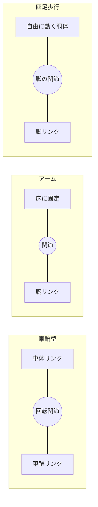

リンクは部品、関節は部品同士の動き方を決める接続である。

### 5.3 まず公式の関節モデルを動かす

最初の関節モデルには、公式のCartpoleを使います。Cartpoleは、台車に棒を取り付けたモデルです。人型や四足型より構造が少なく、関節やリセットの流れを追いやすくなります。

Ubuntuでは、`IsaacLab`フォルダーから次を実行します。

```bash
uv run --extra isaacsim python scripts/tutorials/01_assets/run_articulation.py --viz kit
```

Windowsのコマンドプロンプトでは、次を実行します。

```bat
uv run --extra isaacsim python scripts\tutorials\01_assets\run_articulation.py --viz kit
```

対象タグのソースでは、二つのCartpoleを配置し、ランダムな関節への力を与え、一定ステップごとにリセットします。期待する結果は、床上でモデルが動き、リセットの表示が繰り返されることです。棒を直立させる学習ではありません。[公式の関節モデル例](https://isaac-sim.github.io/IsaacLab/v3.0.0-EA/source/tutorials/01_assets/run_articulation.html)

**写真5-2 公式資料の参考画面：二つのCartpole**


左のViewportで2台の台車と棒を、右のStageで`World`を確認する。[公式チュートリアルの掲載画像](https://isaac-sim.github.io/IsaacLab/v3.0.0-EA/source/tutorials/01_assets/run_articulation.html)であり、本書の指定環境で実行した結果ではない。これは関節モデルの動作確認例で、学習済み方策の成果ではない。

**本書用の撮影手順：** 2台が欠けない視点で、台車の移動関節と棒の回転関節を実際のStage名に合わせて示す。端末の実行コマンドと版を記録する。

**写真5-3 撮影手順：リセット前後**

同じ視点と画面サイズで直前・直後を二枚撮る。端末の`Resetting robot state`と時刻を添え、姿勢とログの両方から初期状態へ戻ったことを確かめる。

### 5.4 設定を読む

公式サンプルでは、用意された設定をコピーし、配置先を変更しています。次は、その考え方を示す抜粋です。単独で実行するコードではなく、起動済みアプリ内の場面を作る処理に置くものです。

```python
from isaaclab_assets import CARTPOLE_CFG

robot_cfg = CARTPOLE_CFG.copy()
robot_cfg.prim_path = "/World/Robot"
```

`CFG`はconfiguration、設定を表す名前として使われています。`copy()`で元の設定をコピーすると、自分の変更を別の設定として扱えます。`prim_path`は、Stage内の配置先です。

公式サンプルには`/World/Origin.*/Robot`という指定があります。これは正規表現で、複数の配置先に一致させるためのものです。正規表現は、文字列のパターンを表す書き方です。初めは「一つの住所を指す指定」と「複数に一致する指定」を区別するだけで十分です。

設定を調べるときは、次の項目を順に読みます。

1. どのUSDアセットを読み込むか。

2. どこへ置くか。

3. 初期位置と関節の初期状態。

4. 質量、衝突、関節の物理設定。

5. 関節を動かす仕組みと、その制限。

関節を動かす装置や、そのモデルを「アクチュエーター」と呼びます。実機のモーターが無限の力を出せないように、シミュレーションでも力や速度の制限を扱います。[公式のアセット設定ガイド](https://isaac-sim.github.io/IsaacLab/v3.0.0-EA/source/how-to/write_articulation_cfg.html)

**図5-3 ロボット設定の五つの層（概念図）**

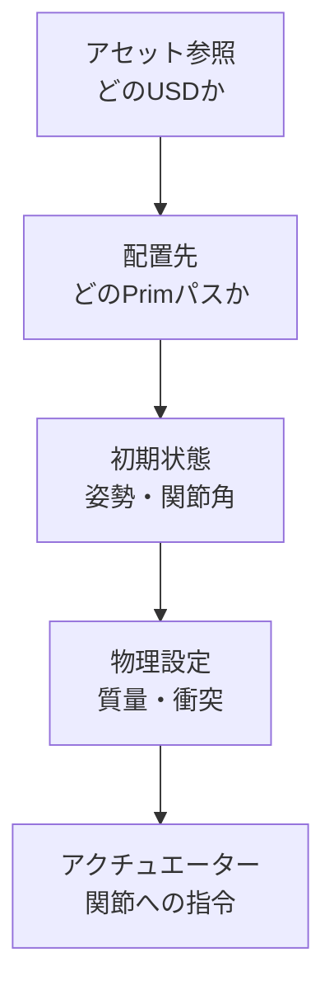

見た目が表示された後も、初期姿勢、物理、アクチュエーターを別々に確かめる。

### 5.5 外部ロボットモデルを取り込む

外部のロボットモデルでよく使われる形式にURDFがあります。URDFはUnified Robot Description Formatの略で、リンク、関節、形状の参照、質量などを記述する形式です。

MJCFは、MuJoCoというシミュレーターで使われるモデル形式です。STLやOBJなどのメッシュ形式は主に表面の形状を表し、必要な関節情報や質量がそろっているとは限りません。

Isaac Labの公式ガイドには、URDFやMJCFをUSDへ変換する方法があります。ここでは本書のIsaac Sim構成を維持し、URDFの変換ツールを使う例を示します。先に自分のモデルと参照するメッシュを用意します。

```text
uv run --extra isaacsim python scripts/tools/convert_urdf.py --help
```

`--help`で入力形式とオプションを確認します。起動処理が入るツールでは、ヘルプでも実行環境の準備が走ることがあります。次は実際に出力ファイルを書き込む例です。パスは自分のファイルへ置き換えてください。

```text
uv run --extra isaacsim python scripts/tools/convert_urdf.py path/to/robot.urdf path/to/output_dir
```

既定の変換設定が、自分のロボットに適しているとは限りません。固定土台か自由な土台か、関節をどう扱うか、駆動の設定は何かをヘルプと公式ガイドで確かめます。たとえば、固定関節を結合する設定は、元の階層や参照するリンク名に影響することがあります。

Isaac Sim 6ではURDF importerの仕組みが更新されています。古い記事のC++バインディング経由の呼び出しや`make_instanceable`の設定を、そのまま移植しないようにします。[対象版のアセット変換ガイド](https://isaac-sim.github.io/IsaacLab/v3.0.0-EA/source/how-to/import_new_asset.html)

変換後は、生成されたUSDをIsaac Simで開き、Stageとプロパティを確認します。プロパティは、選択した物体の設定値を表示する欄です。保存されたUSDが参照するメッシュなども、まとめて管理してください。

**図5-4 URDFからIsaac Labへ（概念図）**

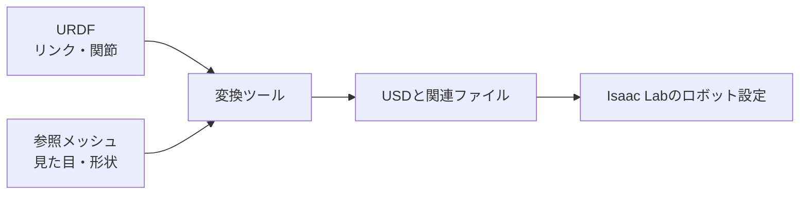

URDFが参照するメッシュも変換時に必要。USDが生成された後に配置と物理設定を確認する。

**写真5-4 撮影手順：URDFの変換**

入力URDF、参照メッシュ、出力先、実行コマンドを端末画面に残す。出力フォルダーの実ファイル一覧も撮り、USDと関連ファイルの有無を確認する。架空のファイル一覧を成功例として使わない。

**写真5-5 公式資料の参考画面：変換後のモデル**


[公式のURDF変換チュートリアル](https://isaac-sim.github.io/IsaacLab/v3.0.0-EA/source/how-to/import_new_asset.html)の参考画像。モデル表示の例であり、本書のURDFを変換した証拠ではない。画像が小さいため、関節軸、制限、質量の値を読み取る資料には使わない。

**本書用の撮影手順：** 生成USDを開き、Stageで関節またはリンクを選ぶ。Propertyの関節軸、制限、質量をそれぞれ読める倍率で撮る。画面ラベルと操作順は撮影したIsaac Sim 6.1の表示に合わせる。

### 5.6 見た目と物理を分けて確認する

見た目が整ったロボットでも、物理設定が不適切なら正しく動きません。表示用の形状と、衝突判定に使う形状が違うこともあります。

衝突形状は、接触を計算するための形です。見た目の細かな形状をすべて使うより、単純な形状で近似することがあります。質量は重さに関わり、慣性は回転しにくさに関わります。摩擦は、床と足や車輪の滑り方に関係します。

確認は、停止した状態で大きさと配置を見て、次に物理を動かし、最後に小さな指令を与える順で進めます。最初から大きな力を入れると、設定の問題を見分けにくくなります。

| 現象 | 調べる候補 |
| --- | --- |
| 床をすり抜ける | 床とロボットの衝突設定、接触対象 |
| 開始直後に大きく跳ねる | 初期状態の食い込み、関節設定、時間幅 |
| 車輪が逆向きに回る | 関節軸、正方向、左右の対応 |
| 腕の土台ごと倒れる | 固定土台と自由な土台の設定 |
| 足が滑り続ける | 摩擦、接触形状、指令、質量 |
| 1000倍ほど大きさが違う | メッシュの単位、変換時のスケール |

この表は、原因を断定するものではありません。候補を一つずつ調べ、変更前後の結果を残します。

**未撮影の写真：写真5-6。** 衝突形状の表示を有効にした実画面を撮り、足または車輪の見た目と衝突形状を比較する。表示方法は撮影版のUIで確認し、キャプションに操作順を記録する。

撮影時は、①対象のOSとIsaac Sim／Isaac Labの版、②実行したコマンドまたは画面操作、③撮影した時点、④画面で読める成功・失敗の根拠を記録する。画面上の実際の名前と本文の例が異なる場合は、キャプションを実画面に合わせる。

### 5.7 ロボットの制御と学習を分ける

ロボットを関節指令で動かすことと、方策を学習することは別の段階です。まず一つの関節や台車に指令を与え、期待する方向へ動くかを確認します。その後、観測、行動、報酬、終了条件をそろえて、学習のタスクへ進みます。

物理計算が0.01秒ごとでも、行動を毎回更新するとは限りません。たとえば物理を4回進めるごとに行動を更新すれば、行動の更新間隔は0.04秒になります。この回数をdecimationと呼ぶ構成があります。学習や実機への移行では、この時間関係もそろえます。

次の表を一度書くと、タスクの不足が見つけやすくなります。

| 項目 | 自分のタスクで書くこと |
| --- | --- |
| 観測 | 何を、どの順番、単位、座標系で渡すか |
| 行動 | 力、速度、角度のどれを指示するか |
| 報酬 | 目的へ近づいたことをどう評価するか |
| 終了 | 成功、失敗、時間上限をどう決めるか |
| リセット | どの姿勢や位置から再開するか |
| 評価 | 学習の報酬以外に何を測るか |

この初稿では、この表を理解するところまでを扱います。具体的なTurtleBot3とBittleのタスク設計は、第6・7章に追加する内容です。

### 5.8 チェックポイント

- [ ] 床と照明を追加する処理を読める。

- [ ] Cartpoleの動作を、学習済み方策と区別して確認できる。

- [ ] リンク、関節、Articulation、アクチュエーターの意味がわかる。

- [ ] URDFと参照メッシュをまとめて管理できる。

- [ ] 表示形状、衝突形状、質量、関節軸を別々に確認できる。

- [ ] 変更する項目を一つに絞り、結果を比べられる。

## 第6章 ハンズオン実践1 TurtleBot3

今回は未収録です。差動二輪の環境構築、観測と行動の設計、PPOによるナビゲーション学習は、次の稿で扱います。

## 第7章 ハンズオン実践2 Bittle

今回は未収録です。Bittleのモデル整備、四足歩行の観測と報酬、学習と実機への対応は、次の稿で扱います。公式の四足歩行モデルが、そのままBittleへ対応するとは想定しません。

## 第8章 まとめと今後の展望

### 8.1 ここまでに学んだこと

本書では、シミュレーションが力や接触を計算すること、強化学習が観測と行動の経験から方策を改善することを学びました。さらに、Isaac LabとIsaac Simの役割を分け、対応するソースを取得し、空の場面から床、照明、関節モデルへ進む手順を確認しました。

ロボット学習では、難しいアルゴリズムだけが重要なのではありません。どの版を使ったか、モデルの関節はどう定義されているか、単位は何か、どの順番で状態を読むか。こうした土台を確認できることが、実験を進める力になります。

うまく動かなかったときも、すべてを一度に作り直す必要はありません。「起動」「アセットの読み込み」「物理」「指令」「観測」「学習」のどこまで確認できたかを戻って調べます。

**図8-1 学びの段階（概念図）**

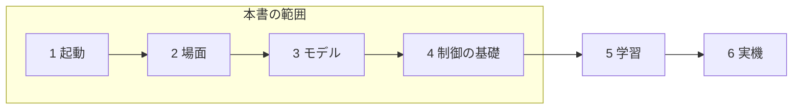

本書の到達点は制御の基礎まで。学習と実機は次の段階として扱う。

### 8.2 次は小さな学習タスクへ進む

次の学習では、公式のCartpoleなど、構造の小さいタスクを選びます。まず観測と行動の内容を読み、終了条件と報酬を確認します。自分でロボットを取り込む前に、公式タスクの結果を再現できると、後の問題を分けやすくなります。

学習ライブラリは、PPOなどの計算を担当するソフトです。Isaac Labの対応ライブラリにはRSL RL、SKRLなどがあります。ライブラリとタスクで設定名や保存形式が異なるため、最初は公式の一つの組み合わせを使います。

学習後に保存された方策を読み込み、評価する段階を「推論」と呼びます。学習は方策を更新する処理、推論は方策を使って行動を選ぶ処理です。

初めての学習では、短い動作確認から始めます。ログが保存されるか、環境がリセットされるか、方策の保存と読み込みができるかを確認してから、長い学習へ進みます。[対象版のQuickstart](https://isaac-sim.github.io/IsaacLab/v3.0.0-EA/source/setup/quickstart.html)

**未撮影の写真：写真8-1。** 次の稿で学習を実行した際に、報酬の推移と評価時の動作を並べる。横軸、縦軸、試行条件、保存した方策の識別情報を記す。未測定の曲線は掲載しない。

撮影時は、①対象のOSとIsaac Sim／Isaac Labの版、②実行したコマンドまたは画面操作、③撮影した時点、④画面で読める成功・失敗の根拠を記録する。画面上の実際の名前と本文の例が異なる場合は、キャプションを実画面に合わせる。

### 8.3 Sim-to-Realで何が変わるか

Sim-to-Realは、シミュレーションで作った方策や制御を、実際のロボットへ移すことです。仮想空間と実機の差を「リアリティギャップ」と呼びます。

現実には、モーターの応答の遅れ、センサーの誤差、通信の遅れ、部品の個体差があります。床の摩擦やバッテリーの状態も変わります。画面上で歩いた方策を、そのまま実機へ送れば必ず歩く、という関係ではありません。

移行で最初にそろえるのは、方策の入力と出力です。関節の順番、角度の単位、姿勢の表現、観測の正規化、指令の倍率、制御周期が違うと、同じ方策でも別の意味になります。正規化は、値の範囲や尺度をそろえる処理です。

| 確認項目 | 食い違いの例 |
| --- | --- |
| 関節の順番 | 左前脚と右前脚が入れ替わる |
| 単位 | 度の値をラジアンとして渡す |
| 座標系 | 本体の速度へワールドの速度を渡す |
| 観測の処理 | 学習時の正規化を省く |
| 行動の意味 | 角度の増分を絶対角度として使う |
| 時間 | 学習時と実機の更新周期が違う |

公式の実機移行資料では、方策の入出力や配置先の環境を扱っています。実機の手順を始める際は、使用する機体に対応する資料も合わせて確認します。[公式のSim2Real資料](https://isaac-sim.github.io/IsaacLab/v3.0.0-EA/source/policy_deployment/index.html)

**図8-2 Sim-to-Realで照合する項目（概念図）**

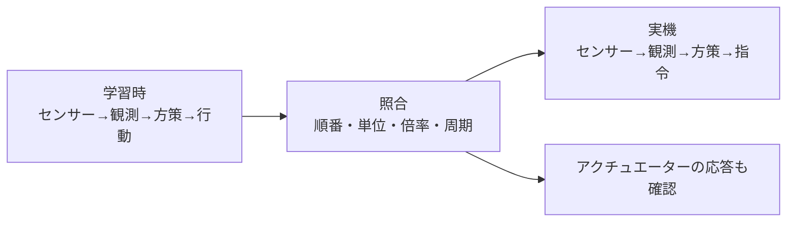

入出力の順番、単位、倍率、周期を学習時と実機で照合する。

### 8.4 条件の変化を学習へ含める

ドメインランダマイゼーションは、学習中に質量、摩擦、観測の誤差などの条件を変える方法です。ひとつの条件だけに適応しすぎることを避け、条件が違っても動ける方策を目指します。

ただし、何でも大きく変えればよいわけではありません。実機から離れすぎた条件を大量に加えると、課題が必要以上に難しくなることがあります。まず実機や想定する環境を調べ、変動する範囲を考えます。

もう一つの工夫がカリキュラム学習です。簡単な条件から始め、達成状況に応じて難しくします。たとえば平らな床で動きを確認してから、段差や外乱を増やします。外乱は、外から受ける予期しない力や変化です。

こうした方法は、土台の物理設定や入出力の不一致を直す代わりにはなりません。基礎の確認を終えた後に、一つずつ加えて効果を測りましょう。

### 8.5 公式資料とコミュニティの使い方

調べる順番は、対象版の公式ページ、公式ソース、既知の問題、コミュニティの順がおすすめです。検索で見つかった手順は、対象のIsaac LabとIsaac Simが一致しているかを最初に確認します。

質問では、目的、実行したコマンド、環境、期待結果、実際の結果をまとめます。エラーは文章だけでなく、コピーできるテキストとして残すと、調べやすくなります。

```text
やりたいこと：空の場面サンプルを起動したい
OSとGPU：
ドライバー：
Isaac Labのタグとコミット：
Isaac SimとPythonの版：
実行した場所とコマンド：
期待した結果：
実際の結果とエラー：
これまでに確認したこと：
```

Isaac LabのGitHub Discussionsは質問や相談、Issuesは再現できる不具合の報告などに使われています。Isaac SimについてはNVIDIA Developer Forumsも参照できます。[公式リポジトリの案内](https://github.com/isaac-sim/IsaacLab#support)

### 8.6 最後のチェックポイント

- [ ] 本書の起動手順を、自分の環境情報と合わせて記録した。

- [ ] 観測、行動、報酬、終了条件の表を書ける。

- [ ] 学習と推論を区別できる。

- [ ] Sim-to-Realで合わせる入力と出力を説明できる。

- [ ] 次に読む公式サンプルを一つ選んだ。

ロボット学習の最初の一歩は、自分が何を設定し、何を確かめたかを説明できるようになることです。空の場面が起動したら、床を追加する。モデルが見えたら、関節を調べる。その積み重ねを、次の学習タスクへつなげていきましょう。

## 付録 次に読む公式リソース

以下は本書の確認に使った公式資料を中心にまとめたものです。`v3.0.0-EA`付きのURLは本書の対象版、Isaac Simの`latest`は更新されるページです。実際の導入時は、ページ上の版も確認してください。

| 読む順番 | 資料 | 調べる内容 |
| --- | --- | --- |
| 1 | [Isaac Labの対応表](https://github.com/isaac-sim/IsaacLab#isaac-sim-version-dependency) | LabとSimの組み合わせ |
| 2 | [Isaac Labの導入](https://isaac-sim.github.io/IsaacLab/v3.0.0-EA/source/setup/installation/index.html) | uv、自動導入、追加機能 |
| 3 | [Isaac Simの要件](https://docs.isaacsim.omniverse.nvidia.com/latest/installation/requirements.html) | GPU、OS、ドライバー、互換性 |
| 4 | [Isaac Simのインストール案内](https://docs.isaacsim.omniverse.nvidia.com/latest/installation/index.html) | ワークステーション、Python、コンテナー |
| 5 | [空の場面を作る](https://isaac-sim.github.io/IsaacLab/v3.0.0-EA/source/tutorials/00_sim/create_empty.html) | AppLauncherとSimulationContext |
| 6 | [関節モデルを操作する](https://isaac-sim.github.io/IsaacLab/v3.0.0-EA/source/tutorials/01_assets/run_articulation.html) | 配置、指令、状態更新、リセット |
| 7 | [アセットの取り込み](https://isaac-sim.github.io/IsaacLab/v3.0.0-EA/source/how-to/import_new_asset.html) | URDFとMJCFからUSDへの変換 |
| 8 | [アセット設定の作成](https://isaac-sim.github.io/IsaacLab/v3.0.0-EA/source/how-to/write_articulation_cfg.html) | ロボットの初期状態と駆動設定 |
| 9 | [センサー](https://isaac-sim.github.io/IsaacLab/v3.0.0-EA/source/concepts/sensors/index.html) | 各センサーの仕様と制約 |
| 10 | [バックエンドとプリセット](https://isaac-sim.github.io/IsaacLab/v3.0.0-EA/source/concepts/backends_and_presets.html) | 物理、描画、表示の選択 |
| 11 | [タスクの設計方式](https://isaac-sim.github.io/IsaacLab/v3.0.0-EA/source/concepts/task_workflows.html) | Manager-basedとDirect |
| 12 | [How-to Guides](https://isaac-sim.github.io/IsaacLab/v3.0.0-EA/source/how-to/index.html) | 次に取り組む個別の例 |
| 13 | [Sim2Real](https://isaac-sim.github.io/IsaacLab/v3.0.0-EA/source/policy_deployment/index.html) | 方策の出力と実機への接続 |

PPOをもう少し詳しく知りたい場合は、NVIDIA資料とは別に、[PPOの原論文](https://arxiv.org/abs/1707.06347)も参照できます。最初から式をすべて理解する必要はありません。経験を集める処理と方策を更新する処理を分けて読んでみてください。

公式のソースも、本文と同じタグで開きます。

- [空の場面のPythonソース](https://github.com/isaac-sim/IsaacLab/blob/v3.0.0-EA/scripts/tutorials/00_sim/create_empty.py)

- [関節モデルのPythonソース](https://github.com/isaac-sim/IsaacLab/blob/v3.0.0-EA/scripts/tutorials/01_assets/run_articulation.py)

- [依存関係の定義](https://github.com/isaac-sim/IsaacLab/blob/v3.0.0-EA/pyproject.toml)

- [Isaac Lab Discussions](https://github.com/isaac-sim/IsaacLab/discussions)

- [NVIDIA Isaac Sim Forum](https://forums.developer.nvidia.com/c/omniverse/isaac-sim/69)

## 付録 図版制作と実行確認の記録

### 図版を作るときの共通ルール

図解は「どこを見れば、何がわかるか」が伝わるように作ります。色だけで意味を分けず、線種やラベルを併用します。概念図には概念図と明記し、測定結果と区別します。

スクリーンショットは、対応するGPU環境で実際の操作を行って撮影します。操作前後は視点と画面サイズをそろえ、必要なパネルや端末の出力を残します。図中の文字は、誌面で読める大きさにします。

初回掲載時には、ファイル名、対象章、OS、Isaac Sim、Isaac Labのタグとコミット、操作、期待結果、実際の結果を記録します。画面に出た個人名や不要なパスは除きますが、確認に必要な情報は残します。

### 実行確認表

この表は、原稿を実画面付きの版に仕上げるための確認欄です。現在は未実行です。

| 確認する操作 | 成功と判断する条件 | この初稿の確認状況 |
| --- | --- | --- |
| 対象版の取得 | タグとコミットが記録される | 公式手順・公開ソースを照合 |
| 空の場面の起動 | 画面が開き、起動完了表示が出る | GPU実行は未確認 |
| `book_scene.py` | 床と照明が表示される | コード構成を照合、GPU実行は未確認 |
| 関節モデルの例 | 二つのモデルが動き、リセットされる | 対象タグのソースを照合、GPU実行は未確認 |
| 外部URDFの変換 | 参照形状がそろったUSDを生成する | モデル未指定、実変換は未確認 |
| 変換モデルの物理確認 | 衝突、関節、単位、初期状態が適切 | モデル未指定、未確認 |

第6・7章の学習実行、学習済み方策の評価、実機への転送は、この初稿の確認範囲に含めません。


